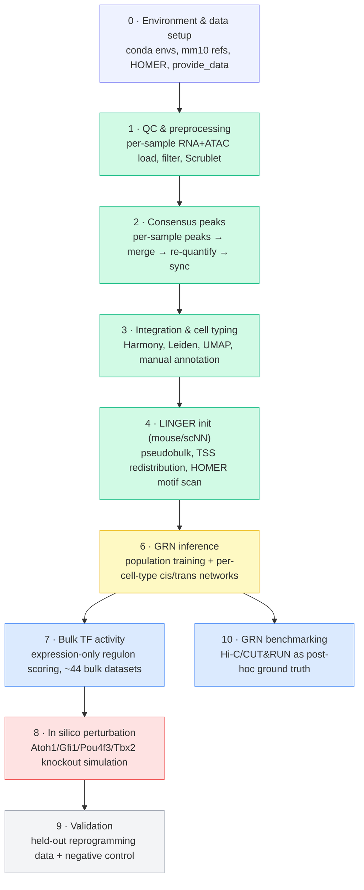

# LINGER Cochlear GRN Pipeline

A reproducible Snakemake workflow that builds mouse cochlear gene regulatory
networks (GRNs) from paired single-cell multiome (RNA+ATAC) data using
[LINGER](https://github.com/Durenlab/LINGER), then uses those networks to
simulate transcription-factor knockouts relevant to hair-cell regeneration
and cochlear aging.

The pipeline takes 10x multiome libraries from four mouse cochlea samples
through QC, consensus peak calling, batch integration and cell typing,
LINGER initialisation, and per-cell-type GRN inference — then layers on
bulk RNA-seq TF-activity scoring, in silico TF perturbation, validation
against held-out reprogramming data, and GRN benchmarking against
independent Hi-C/CUT&RUN ground truth. Everything runs on the University
of Edinburgh's Eddie (SGE) HPC cluster via Snakemake's SGE executor.

---

## Pipeline overview



**Legend:** green = done on real data · yellow = in progress/debugging ·
blue = built, not yet run · red = blocked · gray = not built.

Module 5 (chromatin priors) is not a separate pipeline stage — see
[Design notes](#design-notes).

| Stage | Rule file | Tool(s) | Purpose | Status |
|---|---|---|---|---|
| 0 | *(manual)* | conda, HOMER, `setup_linger.sh` | Conda envs, mm10 references, LINGER pretrained weights, HOMER + mm10 genome package | ✅ Done |
| 1 | `01_qc_preprocessing.smk` | Scanpy, Scrublet | Per-sample RNA+ATAC load, QC filtering, doublet detection | ✅ Done |
| 2 | `02_consensus_peaks.smk` | bedtools, SnapATAC2 | Consensus peak set, re-quantification, RNA/ATAC barcode sync, sanity checks | ✅ Done |
| 3 | `03_integration_celltyping.smk` | Harmony, Leiden, UMAP | Batch integration, clustering, marker scoring, **manual** cell-type labelling | ✅ Done |
| 4 | `04_linger_init.smk` | LINGER (`scNN`), HOMER | Pseudobulking, TSS redistribution, motif scanning against `MotifTarget.bed` | ✅ Done |
| 6 | `06_grn_inference.smk` | LingerGRN (`LL_net`, `LINGER_tr`) | Population-level training + per-cell-type cis/trans regulatory networks | 🟡 Debugging |
| 7 | *(built, not merged)* | LingerGRN (`TF_activity`) | Expression-only TF activity across ~38 bulk + 6 baseline RNA-seq datasets | 🔵 Built |
| 8 | *(not built)* | LingerGRN (`perturb`) | Atoh1/Gfi1/Pou4f3 (single + triple) and Tbx2 knockout simulation | 🔴 Blocked |
| 9 | *(not built)* | — | Validation against held-out reprogramming data + negative control | ⚪ Blocked on 8 |
| 10 | *(built, not merged)* | bedtools, scikit-learn | AUROC/AUPR of inferred edges vs. Hi-C/CUT&RUN ground truth | 🔵 Built |

See [Development log](#development-log) for what "Debugging"/"Built"/"Blocked"
mean concretely as of the last session.

---

## Repository structure

```
.
├── Snakefile                        # entry point; includes rule modules 1-4,6; defines rule all
├── README.md
├── SETUP.md                          # detailed Eddie setup walkthrough
├── config/
│   └── config_eddie.yaml             # all paths, sample manifest, per-rule SGE resources
├── profiles/
│   └── eddie/config.yaml             # Snakemake SGE executor profile (used in-repo, no copying needed)
├── envs/
│   ├── linger_preproc.yaml           # Modules 1-3 conda env spec
│   └── linger.yaml                   # Modules 4/6/7/8 env spec — reference only, see Requirements
├── setup_linger.sh                   # one-time: conda envs, mm10 refs, HOMER, LINGER weights/provide_data
├── download_datasets.sh              # one-time: pulls + auto-extracts all GEO accessions
├── patch_LL_net_RE_ordering.py       # one-time idempotent patch for a real bug in installed LingerGRN
├── patch_LL_net_cis_reg_load.py      # one-time idempotent patch for a second real bug in installed LingerGRN
└── workflow/
    ├── rules/                        # 01_qc_preprocessing.smk … 06_grn_inference.smk
    └── scripts/                      # per-rule Python helper scripts
```

`07_tf_activity.smk` / `10_grn_benchmarking.smk` and their scripts were
built and verified against the real LingerGRN source but aren't merged
into `workflow/rules/` in this snapshot — see [Usage](#usage).

---

## Requirements

### Software (via conda)

Three separate conda environments — Modules 1–3 build theirs automatically
via `--use-conda`; the LINGER env is pre-built once by `setup_linger.sh`
and reused by direct path, not rebuilt per run:

| Environment | Key contents | Why isolated |
|---|---|---|
| `snakemake_eddie` (orchestrator, self-created) | Python ≥3.11, `snakemake`, `snakemake-executor-plugin-sge`, `conda≥24.7.1` | Runs the `snakemake` CLI itself. Modern Snakemake requires Python ≥3.11, which conflicts with `linger_preproc`'s pinned 3.10 — must be a separate env, never used to run analysis code |
| `linger_preproc` (`envs/linger_preproc.yaml`, built by Snakemake) | scanpy≥1.10, anndata≥0.10, snapatac2==2.9.0, harmonypy≥0.0.10,<0.1.0, leidenalg, scrublet, bedtools | Modules 1–3's single-cell + ATAC stack |
| `LINGER` (pre-built by `setup_linger.sh`, reused by absolute path) | scanpy==1.9.5, anndata==0.9.2, scipy==1.11.3, `LingerGRN==1.105 --no-deps`, rpy2, pytorch | Modules 4/6/7/8. Exact pins arrived at by trial and error to avoid an anndata/scipy conflict — kept isolated and never rebuilt from `envs/linger.yaml` (kept as documentation only) |

### Manual post-install steps

- **HOMER mm10 genome package** — hard prerequisite for Module 4
  (`linger_motif_scan` calls `annotatePeaks.pl` directly):
  ```bash
  qsub <WORK_DIR>/homer_mm10_install.sh
  perl <WORK_DIR>/homer/configureHomer.pl -list | grep mm10   # expect: +  mm10  v7.0
  ```
- **`provide_data` (GRNdir)** — LINGER's reference bundle (motif matches,
  TSS coordinates), downloaded by `setup_linger.sh`.

### Reference data (downloaded automatically by `setup_linger.sh`)

mm10 genome FASTA + GTF, `mm10.chrom.sizes`, LINGER pretrained weights,
JASPAR motifs (unused by the `scNN` code path actually taken, but
downloaded as part of the standard setup).

---

## Configuration

Edit `config/config_eddie.yaml`:

| Key | Should point to |
|---|---|
| `multiome_root` | `<cochlear_datasets>/01_multiome` |
| `chrom_root` | `<cochlear_datasets>/02_chromatin_priors` |
| `scratch` | Pipeline output root, e.g. `<linger_pipeline>/preprocessed` |
| `references.mm10_chrom_sizes` | `<linger_pipeline>/references/mm10/mm10.chrom.sizes` |
| `linger.grn_dir` | `provide_data/provide_data` |
| `linger.conda_env_linger` | Absolute path to your pre-built `LINGER` conda env |

**Gotcha worth knowing:** `module load anaconda` on Eddie loads the
group-managed anaconda install first, which takes precedence over a
personal `envs_dirs` redirect — so `LINGER` and other envs can land under
the group path (`/exports/csce/eddie/biology/groups/.../envs/<user>/...`)
rather than where `setup_linger.sh` intends. After any fresh setup, run
`conda env list | grep LINGER` and update `conda_env_linger` if the path
differs from the config.

`samples:` / `extra_bulk_rna_inputs:` / `extra_chromatin_prior_inputs:`
mirror `sample_config.py` — no edits needed unless `SAMPLES` membership
itself changes.

---

## Usage

### 1. Environment setup and data download (run in parallel)

```bash
# Session 1 — conda envs, mm10 refs, HOMER core, LINGER weights/provide_data
qlogin -l h_vmem=8G -l h_rt=04:00:00
module load anaconda
bash /exports/eddie/scratch/<user>/setup_linger.sh \
     /exports/eddie/scratch/<user>/linger_pipeline

# Session 2 — GEO downloads (login node, no qlogin needed; auto-extracts
# all .tar bundles inline, no manual tar loop required)
bash /exports/eddie/scratch/<user>/download_datasets.sh \
     /exports/eddie/scratch/<user>/cochlear_datasets
```

### 2. HOMER mm10 genome package

```bash
qsub /exports/eddie/scratch/<user>/linger_pipeline/homer_mm10_install.sh
perl /exports/eddie/scratch/<user>/linger_pipeline/homer/configureHomer.pl -list | grep mm10
```

### 3. Get the repo onto Eddie

```bash
scp -r LINGER-Cochlear-TF-Knockout-Pipeline-master \
    <user>@eddie.ecdf.ed.ac.uk:/exports/eddie/scratch/<user>/linger_pipeline/code
```

### 4. Orchestrator env (one-time)

```bash
conda create -n snakemake_eddie python=3.11
conda activate snakemake_eddie
conda install -c conda-forge "conda>=24.7.1"
pip install snakemake snakemake-executor-plugin-sge
```

> **Don't `conda install` anything else into this env** (e.g. `scanpy`) —
> it exists only to run the `snakemake` CLI. A solver-driven install here
> can silently shift versions `snakemake` itself depends on. Analysis code
> (reading `.h5ad`, checking cluster markers, etc.) belongs in
> `linger_preproc`, which is also the env that actually produced those
> files.

### 5. Pre-build the Modules 1–3 conda env

```bash
cd /exports/eddie/scratch/<user>/linger_pipeline/code
conda activate snakemake_eddie
snakemake --use-conda --conda-frontend conda --conda-create-envs-only --cores 1
```

### 6. Dry run

```bash
snakemake --profile profiles/eddie --use-conda --conda-frontend conda \
    --rerun-incomplete --keep-going --latency-wait 60 -n
```

### 7. Run Modules 1–3

```bash
tmux new-session -s linger_run
cd /exports/eddie/scratch/<user>/linger_pipeline/code
conda activate snakemake_eddie
snakemake --profile profiles/eddie --use-conda --conda-frontend conda \
    --rerun-incomplete --keep-going --latency-wait 60 \
    > /exports/eddie/scratch/<user>/linger_pipeline/preprocessed/snakemake_run.log 2>&1 &
```
Detach with `Ctrl-b d`; monitor with `qstat` and `tail -f snakemake_run.log`.
Check `module1_summary.csv`, `qc_sanity_checks/sanity_summary.csv`,
`module3_integration/cluster_umap.png` when it finishes.

### 8. Manual step: cell-type labels

```bash
# 1. Review cluster_umap.png + cluster_marker_scores.csv (Myo7a, Pou4f3,
#    Gfi1, Slc26a5, Sox2, Hes1 per cluster)
# 2. Copy module3_integration/cluster_template.tsv -> cluster_annotation.tsv
# 3. Fill in the cell_type column for every leiden row, then:
snakemake --profile profiles/eddie --use-conda --conda-frontend conda \
    --rerun-incomplete --keep-going --latency-wait 60 \
    <scratch>/module3_integration/cluster_marker_scores.csv \
    <scratch>/module3_integration/cluster_umap.png \
    <scratch>/module3_integration/labeled.h5ad
```

### 9. Module 4 — LINGER initialisation

```bash
snakemake --profile profiles/eddie --use-conda --conda-frontend conda \
    --rerun-incomplete --keep-going --latency-wait 60 \
    <scratch>/module4_linger_init/tss_redist.done \
    <scratch>/module4_linger_init/MotifTarget.bed
```

### 10. Module 6 — GRN inference (current stage)

```bash
snakemake --profile profiles/eddie --use-conda --conda-frontend conda \
    --rerun-incomplete --keep-going --latency-wait 60 module6_all
```
If a retry is needed after a fix, delete the relevant `.done` marker first
(e.g. `population_training.done`) — see
[Development log](#development-log) for the fixes applied so far.

### 11. Modules 7 and 10 (once Module 6 is clean)

Re-add `07_tf_activity.smk` / `10_grn_benchmarking.smk` to
`workflow/rules/` and `Snakefile`'s `include:` block, then:
```bash
snakemake --profile profiles/eddie --use-conda --conda-frontend conda \
    --rerun-incomplete --keep-going --latency-wait 60 module7_all
snakemake --profile profiles/eddie --use-conda --conda-frontend conda \
    --rerun-incomplete --keep-going --latency-wait 60 <benchmark target>
```

---

## Key outputs

All outputs are written under `{scratch}/`, never into the repository:

| Output | Path pattern |
|---|---|
| Per-sample QC summary | `module1_summary.csv` |
| Consensus peak set | `consensus_peaks.bed` |
| QC sanity check summary | `qc_sanity_checks/sanity_summary.csv` |
| Cluster UMAP + marker scores | `module3_integration/cluster_umap.png`, `cluster_marker_scores.csv` |
| Labelled, integrated AnnData | `module3_integration/labeled.h5ad` |
| LINGER motif scan output | `module4_linger_init/MotifTarget.bed` |
| Per-cell-type GRNs | `module6_grn/{celltype}.done` (cis/trans regulatory matrices) |
| TF activity scores (planned) | `module7_tf_activity/` |
| GRN benchmark report (planned) | `module10_benchmark/` (AUROC/AUPR vs. Hi-C/CUT&RUN) |

---

## Design notes

- **Three-environment split.** The orchestrator (`snakemake_eddie`), the
  Modules 1–3 stack (`linger_preproc`), and the pre-built `LINGER` env are
  kept fully isolated because LINGER's exact pins
  (`scanpy==1.9.5`/`anndata==0.9.2`/`LingerGRN==1.105 --no-deps`) conflict
  with the newer stack Modules 1–3 need — mixing them breaks `import
  LingerGRN` or produces subtly different clustering/marker output.
- **`LINGER` env is activated by path, not built from a spec.** Module
  4/6/7/8 rules point `conda:` at an absolute env directory
  (`config["linger"]["conda_env_linger"]`) rather than a `.yaml` file.
  Snakemake's `deployment/conda.py` treats an existing local directory as
  `CondaEnvDirSpec` and activates it directly — `envs/linger.yaml` is kept
  for documentation only.
- **Two mouse-incompatible code paths avoided.** LINGER's full
  atlas-pretrained `'LINGER'` method is hardcoded to hg19/hg38 throughout;
  `method='scNN'` is the only mode with native mouse support and is what
  every rule here uses. This also explains Module 8's blocker (see below).
- **`os.chdir()` workaround for hardcoded relative paths.** `LINGER_tr.get_TSS()`
  and `RE_TG_dis()` read/write hardcoded `./data/...` paths regardless of
  their `outdir` argument — scripts `chdir()` into a shared per-run workdir
  rather than patching LINGER itself.
- **Cell-type labels are a hard pseudobulking prerequisite.**
  `pseudo_bulk.pseudo_bulk()` requires cell-type labels *before*
  pseudobulking, so Module 4 depends on `labeled.h5ad`, not `integrated.h5ad`.
- **Module 5 (chromatin priors) folded into Module 10.** Hi-C/CUT&RUN
  aren't a native LINGER inference-time input — no ingestion path exists
  in `preprocess.py`/`LL_net.py`/`LINGER_tr.py`. Decided to use them purely
  as post-hoc benchmarking ground truth (Module 10) rather than as
  inference-time constraints; post-hoc edge reweighting and
  training-loop-regularization approaches were considered and deferred.

---

## Development log

**Module 6 (GRN inference) — real bugs found running against actual Eddie
data**, none visible from reading LINGER's source alone:
- `GRNdir` needed a trailing slash (LINGER concatenates paths as raw
  strings) — fixed in both Module 6 scripts.
- PyTorch 2.6+'s `weights_only=True` default broke unpickling LINGER's own
  saved models — fixed with a `torch.load` monkeypatch.
- Two real bugs in the installed `LingerGRN` package's single-celltype
  `scNN` branches (`cell_type_specific_TF_RE_binding`'s `RE`-before-assignment
  ordering bug; `cell_type_specific_cis_reg`'s missing `load_RE_TG_scNN()`
  call) — fixed via the two `patch_LL_net_*.py` scripts at the repo root.
- Manually-authored cell-type labels containing commas/slashes/parentheses
  broke Snakemake's own SGE array-job wildcard parsing — fixed by
  sanitizing `cluster_annotation.tsv` and rebuilding `labeled.h5ad`.
- `grn_population_training.py` was missing population-level
  `cis_reg()`/`trans_reg()` calls, needed by both Module 7 and (it turned
  out) Module 6's own celltype step — fixed; `population_training.done`
  deleted and `module6_all` re-run.
- Memory grants bumped (32GB → 48GB) after a real run hit 96% of the old
  grant; a training-resume guard was added so a late-stage failure doesn't
  force a ~4h retrain.
- Latest retry (`module6_all`, `retry10`) was in flight as of the last
  session — confirm its outcome before treating Module 6 as done.

**Module 7 (bulk TF activity)** — built against the real installed
`LingerGRN` source. Caught a bug before running: `network="general"` routes
through an hg19/hg38-only function with no mm10 branch; corrected to
`network="cell population"`. `model_construction_refs` (6 GEO accessions)
resolved to route here, not Module 6/4, since `TF_activity.regulon()` is
the only RNA-only-input function in the package.

**Module 8 (in silico perturbation)** — blocked on a real API gap, not a
design question: `perturb.load_data_ptb()`'s four required input files are
only ever written by LINGER's human/hg19/hg38 training path, never the
mouse-compatible `scNN` path this project uses. Three options under
consideration: look for an undocumented mouse-mode example, reimplement
the forward-pass directly against trained `{chr}_net.pt` files, or build a
compatibility shim. Also blocks Module 9.

**Module 10 (GRN benchmarking)** — built as a bespoke bedtools-intersect +
AUROC/AUPR script, since `LingerGRN.Benchmk.bm_trans()` expects a ChIP-seq
ranked-gene-list ground truth, not chromatin-interaction data. No
dependency on Modules 8/9.

---

## Tools & citations

This pipeline orchestrates the following third-party tools. If you use it,
please cite them alongside this repository:

- **LINGER** — Yuan Q, Duren Z. Integration of single-cell multi-omic data
  to infer gene regulatory networks via LINGER. *Nat Biotechnol*. 2025.
  doi: [10.1038/s41587-024-02182-7](https://doi.org/10.1038/s41587-024-02182-7)
- **Snakemake** — Mölder F, et al. Sustainable data analysis with Snakemake.
  *F1000Research*. 2021;10:33. doi: [10.12688/f1000research.29032.2](https://doi.org/10.12688/f1000research.29032.2)
- **HOMER** — Heinz S, et al. Simple combinations of lineage-determining
  transcription factors prime cis-regulatory elements required for
  macrophage and B cell identities. *Mol Cell*. 2010;38(4):576–589.
  doi: [10.1016/j.molcel.2010.05.004](https://doi.org/10.1016/j.molcel.2010.05.004)
- **Harmony / harmonypy** — Korsunsky I, et al. Fast, sensitive and accurate
  integration of single-cell data with Harmony. *Nat Methods*. 2019;16(12):1289–1296.
  doi: [10.1038/s41592-019-0619-0](https://doi.org/10.1038/s41592-019-0619-0)
- **Scanpy** — Wolf FA, Angerer P, Theis FJ. SCANPY: large-scale single-cell
  gene expression data analysis. *Genome Biol*. 2018;19:15.
  doi: [10.1186/s13059-017-1382-0](https://doi.org/10.1186/s13059-017-1382-0)
- **SnapATAC2** — Zhang K, et al. SnapATAC2: a fast, scalable and versatile
  tool for analysis of single-cell chromatin accessibility data.
  *Nat Methods*. 2024. doi: [10.1038/s41592-023-02139-9](https://doi.org/10.1038/s41592-023-02139-9)
- **Leiden / python-igraph** — Traag VA, Waltman L, van Eck NJ. From Louvain
  to Leiden: guaranteeing well-connected communities. *Sci Rep*. 2019;9:5233.
  doi: [10.1038/s41598-019-41695-z](https://doi.org/10.1038/s41598-019-41695-z)
- **bedtools** — Quinlan AR, Hall IM. BEDTools: a flexible suite of utilities
  for comparing genomic features. *Bioinformatics*. 2010;26(6):841–842.
  doi: [10.1093/bioinformatics/btq033](https://doi.org/10.1093/bioinformatics/btq033)

---

## Author

Darren Lim Jia Sheng (DarrenLJS)

## License

TODO
Released under the MIT License — free to use, modify, and redistribute
with attribution.
