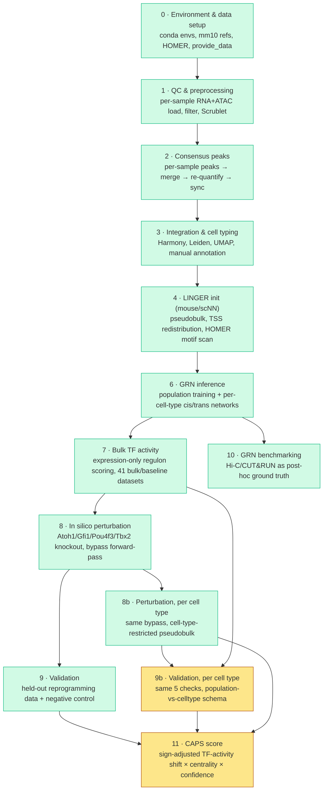

# LINGER Cochlear GRN Pipeline

A reproducible Snakemake workflow that builds mouse cochlear gene regulatory
networks (GRNs) from paired single-cell multiome (RNA+ATAC) data using
[LINGER](https://github.com/Durenlab/LINGER), then uses those networks to
simulate transcription-factor knockouts relevant to hair-cell regeneration
and cochlear aging.

The pipeline takes 10x multiome libraries from four mouse cochlea samples
through QC, consensus peak calling, batch integration and cell typing,
LINGER initialisation, and per-cell-type GRN inference — then layers on
bulk RNA-seq TF-activity scoring, in silico TF perturbation (population- and
cell-type-resolved), validation against held-out reprogramming data
(population- and cell-type-resolved), GRN benchmarking against independent
Hi-C/CUT&RUN ground truth, and a combined CAPS (Cochlear Aging Perturbation
Score) ranking. Everything runs on the University of Edinburgh's Eddie (SGE)
HPC cluster via Snakemake's SGE executor.

**Status as of 2026-09-19: the original ten modules (0–10) have each run on
real Eddie data at least once.** Three modules added this week extend that
core pipeline to cell-type resolution and a combined score:

- **Module 8b** (cell-type-resolved perturbation) has been run for real —
  two genuine bugs surfaced and were fixed (see
  [Development log](#development-log)).
- **Modules 9b** (cell-type-resolved validation) and **11** (CAPS score) are
  built and wired into the `Snakefile`, but **have not yet been run against
  real Eddie data** — treat their outputs as unvalidated until a real run
  happens and any bugs it surfaces are fixed, the same discipline every
  other module here has already been through.

Module 9's population-level result is real and currently weak on three of
four checks, which is a scientific finding worth sitting with, not an
unfinished-pipeline problem — see [Development log](#development-log).

---

## Pipeline overview



**Legend:** green = run end-to-end on real data at least once. Amber = built
and wired into the DAG, not yet run on real data. See the status table below
for per-module caveats — "run" doesn't mean every result is strong (Module 9
in particular has real, weak validation numbers on three of four checks).

Module 5 (chromatin priors) is not a separate pipeline stage — see
[Design notes](#design-notes).

| Stage | Rule file | Tool(s) | Purpose | Status |
|---|---|---|---|---|
| 0 | *(manual)* | conda, HOMER, `setup_linger.sh` | Conda envs, mm10 references, LINGER pretrained weights, HOMER + mm10 genome package | ✅ Done |
| 1 | `01_qc_preprocessing.smk` | Scanpy, Scrublet | Per-sample RNA+ATAC load, QC filtering, doublet detection, gene-level mito/hemoglobin removal | ✅ Done |
| 2 | `02_consensus_peaks.smk` | bedtools, SnapATAC2 | Consensus peak set, re-quantification, RNA/ATAC barcode sync, sanity checks | ✅ Done |
| 3 | `03_integration_celltyping.smk` | Harmony, Leiden, UMAP | Batch integration, clustering, marker scoring, **manual** cell-type labelling — 16 annotated cell types | ✅ Done |
| 4 | `04_linger_init.smk` | LINGER (`scNN`), HOMER | Pseudobulking, TSS redistribution, motif scanning against `MotifTarget.bed` | ✅ Done |
| 6 | `06_grn_inference.smk` | LingerGRN (`LL_net`, `LINGER_tr`) | Population-level training + per-cell-type cis/trans regulatory networks, 16 cell types | ✅ Done |
| 7 | `07_bulk_tf_activity.smk` | LingerGRN (`TF_activity`) | Expression-only TF activity, 41 datasets (37 bulk + 4 baseline) | ✅ Done — `tf_activity_summary.tsv`, 586 TFs |
| 8 | `08_perturbation.smk` | Direct `{chr}_net.pt` forward-pass (bypasses `perturb.py`) | Atoh1/Gfi1/Pou4f3 (single + triple) and Tbx2 knockout, population-pooled | ✅ Done — sanity check median ρ = 0.797 |
| 8b | `08b_perturbation_celltype.smk` | Same bypass, cell-type-restricted pseudobulk | Same 5 knockouts, per cell type (20 cell types ≥100 cells) | ✅ Done — 2 real bugs found & fixed, see below |
| 9 | `09_validation.smk` | scipy, scikit-learn | Correlation + AUROC/AUPR vs. held-out reprogramming/aging data + negative control | ✅ Done — real numbers, weak on 3/4 checks |
| 9b | `09b_validation_celltype.smk` | Same 5 checks, per cell type | Population-vs-celltype schema, reuses `validate_held_out.py` | 🟡 Built, not yet run on real data |
| 10 | `10_grn_benchmarking.smk` | bedtools, scikit-learn | AUROC/AUPR of inferred edges vs. Hi-C/CUT&RUN ground truth | ✅ Done — `benchmark_report.tsv`, 16 cell types |
| 11 | `11_caps_score.smk` | pandas, LingerGRN (`TF_activity`) | CAPS = sign-adjusted TF-activity shift × regulatory centrality × validation confidence | 🟡 Built, not yet run on real data |

All twelve rule files are included in the `Snakefile`. Modules 6–11 are
deliberately NOT part of `rule all` — each depends on real upstream output
existing, not just its rule being defined. Run each stage's own `_all`
target — see [Usage](#usage).

See [Development log](#development-log) for the bugs found and fixed
getting each module from "built" to "run clean," and
[Key outputs](#key-outputs) for where the real result files land.

---

## Repository structure

```
.
├── Snakefile                        # entry point; includes rule modules 1-4,6-11; defines rule all
├── README.md
├── SETUP.md                          # detailed Eddie setup walkthrough
├── config/
│   └── config_eddie.yaml             # all paths, sample manifest, per-rule SGE resources
├── profiles/
│   └── eddie/config.yaml             # Snakemake SGE executor profile (used in-repo, no copying needed)
├── envs/
│   ├── linger_preproc.yaml           # Modules 1-3 conda env spec
│   └── linger.yaml                   # Modules 4/6/7/8/8b env spec — reference only, see Requirements
├── setup_linger.sh                   # one-time: conda envs, mm10 refs, HOMER, LINGER weights/provide_data
├── download_datasets.sh              # one-time: pulls + auto-extracts all GEO accessions
├── patch_LL_net_RE_ordering.py       # one-time idempotent patch for a real bug in installed LingerGRN
├── patch_LL_net_cis_reg_load.py      # one-time idempotent patch for a second real bug in installed LingerGRN
├── other_helper_scripts/             # one-off debugging/verification scripts, not part of the DAG
│   ├── h5ad_breakdown.py             #   per-cluster DE genes + sample composition (Module 3 review)
│   ├── h5ad_check.py                 #   spot-checks marker expression for specific clusters
│   ├── verify_loader_regression.py   #   regression-checks bulk_rna_loader.py rewrites against real output
│   └── sanity_check_motif_naming.sh  #   proves a HOMER PositionID naming fix on a 10-peak slice
└── workflow/
    ├── rules/                        # 01_qc_preprocessing.smk … 11_caps_score.smk
    └── scripts/                      # per-rule Python helper scripts
```

All rule files (`01_qc_preprocessing.smk` … `11_caps_score.smk`) are merged
into `workflow/rules/` and included from `Snakefile` — see
[Usage](#usage) for how to run each stage.

---

## Requirements

### Software (via conda)

Three separate conda environments — Modules 1–3 build theirs automatically
via `--use-conda`; the LINGER env is pre-built once by `setup_linger.sh`
and reused by direct path, not rebuilt per run:

| Environment | Key contents | Why isolated |
|---|---|---|
| `snakemake_eddie` (orchestrator, self-created) | Python ≥3.11, `snakemake`, `snakemake-executor-plugin-sge`, `conda≥24.7.1` | Runs the `snakemake` CLI itself. Modern Snakemake requires Python ≥3.11, which conflicts with `linger_preproc`'s pinned 3.10 — must be a separate env, never used to run analysis code |
| `linger_preproc` (`envs/linger_preproc.yaml`, built by Snakemake) | scanpy≥1.10, anndata≥0.10, snapatac2==2.9.0, harmonypy≥0.0.10,<0.1.0, leidenalg, scrublet, bedtools | Modules 1–3's single-cell + ATAC stack |
| `LINGER` (pre-built by `setup_linger.sh`, reused by absolute path) | scanpy==1.9.5, anndata==0.9.2, scipy==1.11.3, `LingerGRN` (see version note below), rpy2, pytorch | Modules 4/6/7/8/8b/9b/11. Exact pins arrived at by trial and error to avoid an anndata/scipy conflict — kept isolated and never rebuilt from `envs/linger.yaml` (kept as documentation only) |

> **Unresolved version-pin discrepancy, flagged rather than silently
> picked:** `setup_linger.sh` and `envs/linger.yaml` both install and pin
> `LingerGRN==1.105`. But `grn_population_training.py` and
> `grn_celltype_specific.py`'s own docstrings, plus the working plan doc,
> both say "real LingerGRN==1.110 calls, confirmed from source" (pulled
> directly from PyPI during Module 6/7 debugging). One of these is stale —
> either the real Eddie `LINGER` env ended up with 1.110 (e.g. `--no-deps`
> resolved differently at install time than the pin implies) and
> `setup_linger.sh` needs its pin bumped to match, or the docstrings are
> wrong and should cite 1.105. Confirm with `pip show LingerGRN` in the
> real env before trusting either document over the other. Still open.

### Manual post-install steps

- **HOMER mm10 genome package** — hard prerequisite for Module 4
  (`linger_motif_scan` calls `annotatePeaks.pl` directly):
  ```bash
  qsub <WORK_DIR>/homer_mm10_install.sh
  perl <WORK_DIR>/homer/configureHomer.pl -list | grep mm10   # expect: +  mm10  v7.0
  ```
- **`provide_data` (GRNdir)** — LINGER's reference bundle (motif matches,
  TSS coordinates), downloaded by `setup_linger.sh`.

### Reference data (downloaded automatically by `setup_linger.sh`)

mm10 genome FASTA + GTF, `mm10.chrom.sizes`, LINGER pretrained weights,
JASPAR motifs (unused by the `scNN` code path actually taken, but
downloaded as part of the standard setup).

---

## Configuration

Edit `config/config_eddie.yaml`:

| Key | Should point to |
|---|---|
| `multiome_root` | `<cochlear_datasets>/01_multiome` |
| `chrom_root` | `<cochlear_datasets>/02_chromatin_priors` |
| `scratch` | Pipeline output root, e.g. `<linger_pipeline>/preprocessed` |
| `references.mm10_chrom_sizes` | `<linger_pipeline>/references/mm10/mm10.chrom.sizes` |
| `linger.grn_dir` | `provide_data/provide_data` |
| `linger.conda_env_linger` | Absolute path to your pre-built `LINGER` conda env |

**Gotcha worth knowing:** `module load anaconda` on Eddie loads the
group-managed anaconda install first, which takes precedence over a
personal `envs_dirs` redirect — so `LINGER` and other envs can land under
the group path (`/exports/csce/eddie/biology/groups/.../envs/<user>/...`)
rather than where `setup_linger.sh` intends. After any fresh setup, run
`conda env list | grep LINGER` and update `conda_env_linger` if the path
differs from the config.

`samples:` / `extra_bulk_rna_inputs:` / `extra_chromatin_prior_inputs:`
mirror `sample_config.py` — no edits needed unless `SAMPLES` membership
itself changes.

`qc_params.remove_mito_genes` / `remove_hb_genes` (both default `true`)
gate Module 1's gene-level mitochondrial/hemoglobin-gene removal — see
[Design notes](#design-notes).

`perturbation.celltype_knockouts.enabled_celltypes` / `min_cells_for_pseudobulk`
gate which cell types Module 8b (and therefore 9b/11) run for — see
[Design notes](#design-notes).

---

## Usage

Commands below match the pipeline's own run log — run them from the repo
root (`<linger_pipeline>/code`) with `snakemake_eddie` activated, unless
noted otherwise. `$SCRATCH` = `config["scratch"]`
(`<linger_pipeline>/preprocessed` by default).

### 1. Environment setup and data download (run in parallel)

```bash
# Session 1 — conda envs, mm10 refs, HOMER core, LINGER weights/provide_data
qlogin -l h_vmem=8G -l h_rt=04:00:00
module load anaconda
bash /exports/eddie/scratch/<user>/setup_linger.sh \
     /exports/eddie/scratch/<user>/linger_pipeline

# Session 2 — GEO downloads (login node, no qlogin needed; auto-extracts
# all .tar bundles inline, no manual tar loop required)
bash /exports/eddie/scratch/<user>/download_datasets.sh \
     /exports/eddie/scratch/<user>/cochlear_datasets
```

### 2. HOMER mm10 genome package

```bash
qsub /exports/eddie/scratch/<user>/linger_pipeline/homer_mm10_install.sh
perl /exports/eddie/scratch/<user>/linger_pipeline/homer/configureHomer.pl -list | grep mm10
```

### 3. Get the repo onto Eddie

```bash
scp -r LINGER-Cochlear-TF-Knockout-Pipeline-master \
    <user>@eddie.ecdf.ed.ac.uk:/exports/eddie/scratch/<user>/linger_pipeline/code
```

### 4. Orchestrator env (one-time)

```bash
conda create -n snakemake_eddie python=3.11
conda activate snakemake_eddie
conda install -c conda-forge "conda>=24.7.1"
pip install snakemake snakemake-executor-plugin-sge
```

> **Don't `conda install` anything else into this env** (e.g. `scanpy`) —
> it exists only to run the `snakemake` CLI. A solver-driven install here
> can silently shift versions `snakemake` itself depends on. Analysis code
> (reading `.h5ad`, checking cluster markers, etc.) belongs in
> `linger_preproc`, which is also the env that actually produced those
> files.

### 5. Pre-build the Modules 1–3 conda env

```bash
cd /exports/eddie/scratch/<user>/linger_pipeline/code
conda activate snakemake_eddie
snakemake --use-conda --conda-frontend conda --conda-create-envs-only --cores 1
```

### 6. Dry run

```bash
snakemake --profile profiles/eddie --use-conda --conda-frontend conda \
    --rerun-incomplete --keep-going --latency-wait 60 -n
```

### 7. Modules 1 & 2 — QC, preprocessing, consensus peaks

`rule all` covers both, plus the QC sanity checks:

```bash
tmux new-session -s linger_run
cd /exports/eddie/scratch/<user>/linger_pipeline/code
conda activate snakemake_eddie
snakemake --profile profiles/eddie --use-conda --conda-frontend conda \
    --rerun-incomplete --keep-going --latency-wait 60 \
    > $SCRATCH/snakemake_run.log 2>&1 &
```
Detach with `Ctrl-b d`; monitor with `qstat` and `tail -f snakemake_run.log`.
Check `module1_summary.csv` and `qc_sanity_checks/sanity_summary.csv` when
it finishes.

### 8. Module 3 — integration, then manual cell-type annotation

```bash
snakemake --profile profiles/eddie --use-conda --conda-frontend conda \
    --rerun-incomplete --keep-going --latency-wait 60 \
    $SCRATCH/module3_integration/cluster_marker_scores.csv \
    $SCRATCH/module3_integration/cluster_umap.png \
    $SCRATCH/module3_integration/cluster_template.tsv
```
Review `cluster_umap.png` + `cluster_marker_scores.csv` (`Myo7a`, `Pou4f3`,
`Gfi1`, `Slc26a5`, `Sox2`, `Hes1` per cluster), copy `cluster_template.tsv`
to `cluster_annotation.tsv`, fill in the `cell_type` column for every
`leiden` row, then:
```bash
snakemake --profile profiles/eddie --use-conda --conda-frontend conda \
    --rerun-incomplete --keep-going --latency-wait 60 \
    $SCRATCH/module3_integration/labeled.h5ad
```

### 9. Module 4 — LINGER initialisation

```bash
snakemake --profile profiles/eddie --use-conda --conda-frontend conda \
    --rerun-incomplete --keep-going --latency-wait 60 \
    $SCRATCH/module4_linger_init/tss_redist.done \
    $SCRATCH/module4_linger_init/MotifTarget.bed
```

### 10. Module 6 — GRN inference

```bash
snakemake --profile profiles/eddie --use-conda --conda-frontend conda \
    --rerun-incomplete --keep-going --latency-wait 60 module6_all
```
If a retry is needed after a fix, delete the relevant `.done` marker first
(e.g. `population_training.done`) — see
[Development log](#development-log) for the fixes applied so far.

### 11. Module 7 — bulk TF activity

```bash
snakemake --profile profiles/eddie --use-conda --conda-frontend conda \
    --rerun-incomplete --keep-going --latency-wait 60 module7_all
```

### 12. Module 8 — in silico perturbation (population-pooled)

**Run the sanity check first and read its log before trusting anything
else from this module** — see [Design notes](#design-notes) for why:

```bash
snakemake --profile profiles/eddie --use-conda --conda-frontend conda \
    --rerun-incomplete --keep-going --latency-wait 60 \
    $SCRATCH/module8_perturbation/_sanity_check_baseline_predicted.tsv
tail -30 $SCRATCH/logs/08b_sanity_check.log   # read the SANITY CHECK block
```
If the median Spearman rho reported there is clearly positive (not near
zero), proceed:
```bash
snakemake --profile profiles/eddie --use-conda --conda-frontend conda \
    --rerun-incomplete --keep-going --latency-wait 60 module8_all
```

### 13. Module 8b — perturbation, per cell type

Same bypass as Module 8, run against a cell-type-restricted pseudobulk
instead of the population-pooled one. **Read each cell type's own sanity
check log before trusting its knockout output** — a passing population
sanity check does not establish a cell type's narrower input is
in-distribution for the pooled-population net:

```bash
snakemake --profile profiles/eddie --use-conda --conda-frontend conda \
    --rerun-incomplete --keep-going --latency-wait 60 module8b_all
#   -> read $SCRATCH/logs/08b_sanity_check_{celltype}.log per cell type
#      before trusting its output
```

### 14. Module 9 — validation against held-out data (population)

```bash
snakemake --profile profiles/eddie --use-conda --conda-frontend conda \
    --rerun-incomplete --keep-going --latency-wait 60 module9_all
```

### 15. Module 9b — validation, per cell type

Mirrors Module 9's 5 checks per cell type; population and cell-type results
are reported side by side with an identical schema, neither treated as
primary — see `09b_validation_celltype.smk`'s header:

```bash
snakemake --profile profiles/eddie --use-conda --conda-frontend conda \
    --rerun-incomplete --keep-going --latency-wait 60 module9b_aggregate
```
Read `validation_report_combined.tsv`'s `sanity_rho` column per scope
before trusting any cell type's checks — same "read before trusting"
convention as Modules 8/8b's sanity checks, at the output-report level
rather than a separate log.

### 16. Module 10 — GRN benchmarking (no dependency on 7–9)

```bash
snakemake --profile profiles/eddie --use-conda --conda-frontend conda \
    --rerun-incomplete --keep-going --latency-wait 60 benchmark_grn_edges
```

### 17. Module 11 — CAPS score

Needs Module 9b's `validation_report_combined.tsv` for its
`confidence_weight` term; does **not** depend on Module 10:

```bash
snakemake --profile profiles/eddie --use-conda --conda-frontend conda \
    --rerun-incomplete --keep-going --latency-wait 60 module11_all
```

### 18. Reading the reports

```bash
column -t -s $'\t' $SCRATCH/module9_validation/validation_report.tsv
column -t -s $'\t' $SCRATCH/module9b_validation_celltype/validation_report_combined.tsv
column -t -s $'\t' $SCRATCH/module10_benchmarking/benchmark_report.tsv
column -t -s $'\t' $SCRATCH/module11_caps/caps_scores.tsv
```

### Starting a run over from scratch

To wipe every intermediate output and re-run as if from a clean checkout
(only ever do this deliberately — it deletes real result files):

```bash
rm -rf $SCRATCH/GSE182202_P8 $SCRATCH/GSE224563_P1 $SCRATCH/GSE224563_P70_wildtype $SCRATCH/GSE224563_P70_deafened
rm -rf $SCRATCH/_peak_bed
rm -f  $SCRATCH/_all_peaks_concat.bed $SCRATCH/_all_peaks_sorted.bed $SCRATCH/consensus_peaks.bed
rm -rf $SCRATCH/qc_sanity_checks $SCRATCH/module3_integration $SCRATCH/module4_linger_init \
       $SCRATCH/module6_grn $SCRATCH/module7_tf_activity $SCRATCH/module8_perturbation \
       $SCRATCH/module9_validation $SCRATCH/module9b_validation_celltype \
       $SCRATCH/module10_benchmarking $SCRATCH/module11_caps $SCRATCH/logs $SCRATCH/benchmarks
rm -f  $SCRATCH/module1_summary.csv
```
Then repeat steps 7 onward.

---

## Key outputs

All outputs are written under `{scratch}/`, never into the repository:

| Output | Path pattern |
|---|---|
| Per-sample QC summary | `module1_summary.csv` |
| Consensus peak set | `consensus_peaks.bed` |
| QC sanity check summary | `qc_sanity_checks/sanity_summary.csv` |
| Cluster UMAP + marker scores | `module3_integration/cluster_umap.png`, `cluster_marker_scores.csv` |
| Labelled, integrated AnnData | `module3_integration/labeled.h5ad` |
| LINGER motif scan output | `module4_linger_init/MotifTarget.bed` |
| Per-cell-type GRNs | `module6_grn/{celltype}.done` (cis/trans regulatory matrices) |
| TF activity scores | `module7_tf_activity/tf_activity_summary.tsv` |
| Perturbation sanity check (population) | `module8_perturbation/_sanity_check_baseline_predicted.tsv` (+ log — READ THIS FIRST) |
| Knockout predictions (population) | `module8_perturbation/{ko_id}_predicted_expression.tsv` |
| Perturbation sanity check (per cell type) | `module8_perturbation/celltype/{celltype}/_sanity_check_baseline_predicted.tsv` (+ log — READ THIS FIRST) |
| Knockout predictions (per cell type) | `module8_perturbation/celltype/{celltype}/{ko_id}_predicted_expression.tsv` |
| Validation report (population) | `module9_validation/validation_report.tsv` (correlation + AUROC/AUPR + pass/fail per held-out check) |
| Validation report (population + per cell type) | `module9b_validation_celltype/validation_report_combined.tsv` |
| GRN benchmark report | `module10_benchmarking/benchmark_report.tsv` (AUROC/AUPR vs. Hi-C/CUT&RUN) |
| CAPS scores | `module11_caps/caps_scores.tsv` (population + per cell type, per knockout) |

---

## Results snapshot (2026-09-13 run)

Real numbers from the current output files, kept here so the README
doesn't just say "done" without showing what that means. Modules 8b, 9b
and 11 are not included below — 8b has run but its output hasn't yet been
summarised into headline numbers here, and 9b/11 haven't been run at all
yet (see [Pipeline overview](#pipeline-overview)).

- **Module 3** — 16 annotated cell types across 29 Leiden clusters, ~13k
  cells; three GSE224563/GSE182202 batches integrate cleanly with no
  strong batch-driven substructure in the UMAP.
- **Module 8 sanity check** — median Spearman ρ = **0.797** (mean 0.668,
  80% of 23,082 genes above ρ>0.3) between the reconstructed-order forward
  pass and real pseudobulk expression — clearly positive, so the
  `PYTHONHASHSEED`-dependent TF-ordering risk flagged in
  [Design notes](#design-notes) did not materialise for this run. Real
  knockout output is trusted on this basis.
- **Module 9 validation** — of four checks with a real ground truth:
  - `atoh1_gfi1_pou4f3_overexpression` (GSE224627): **PASS** (ρ=0.44, AUROC=0.77)
  - `tbx2_conversion` (GSE233559): **FAIL** (ρ=−0.60, AUROC=0.75 — note the
    sign: AUROC alone looks fine, but the correlation runs the wrong
    direction once sign-adjusted for the gain-of-function comparison)
  - `negative_control_must_not_reprogram` (GSE281207): **FAIL** — the
    control shows about as strong a signal (ρ=0.72) as the real positive
    checks, meaning the model isn't cleanly discriminating "should
    reprogram" from "shouldn't"
  - `aging_vector_support` (3 usable datasets vs. the GSE274279 reference
    vector): all three near zero/non-significant (ρ = −0.02, −0.07, 0.15)
    — the aging-shift prediction doesn't externally validate by this
    metric yet.

  **Read this as a real, partially negative result, not a broken
  pipeline** — the numbers only became trustworthy this session once two
  genuine bugs were fixed (see [Development log](#development-log)); the
  pipeline was previously hiding this outcome behind a hardcoded `1.0`.
- **Module 10 benchmarking** — `cis_RE_TG` vs. Hi-C loops sits at
  AUROC 0.51–0.52 across all 16 cell types (same edge universe per
  cell type, only the score column varies — expected, not a bug, but a
  genuinely weak signal). `TF_RE_binding` vs. CUT&RUN varies meaningfully
  by cell type and TF: Atoh1 AUROC 0.58–0.78, Pou4f3 AUROC 0.53–0.66
  (both wild-type and MEF-reprogramming ground truth) — a real,
  celltype-sensitive signal, unlike the cis edges.

---

## Design notes

- **Three-environment split.** The orchestrator (`snakemake_eddie`), the
  Modules 1–3 stack (`linger_preproc`), and the pre-built `LINGER` env are
  kept fully isolated because LINGER's exact pins
  (`scanpy==1.9.5`/`anndata==0.9.2`/`LingerGRN==1.105 --no-deps`) conflict
  with the newer stack Modules 1–3 need — mixing them breaks `import
  LingerGRN` or produces subtly different clustering/marker output.
- **`LINGER` env is activated by path, not built from a spec.** Modules
  4/6/7/8/8b/9b/11 point `conda:` at an absolute env directory
  (`config["linger"]["conda_env_linger"]`) rather than a `.yaml` file.
  Snakemake's `deployment/conda.py` treats an existing local directory as
  `CondaEnvDirSpec` and activates it directly — `envs/linger.yaml` is kept
  for documentation only.
- **Two mouse-incompatible code paths avoided.** LINGER's full
  atlas-pretrained `'LINGER'` method is hardcoded to hg19/hg38 throughout;
  `method='scNN'` is the only mode with native mouse support and is what
  every rule here uses. This is also why Module 8 bypasses `perturb.py`
  entirely — see the next bullet.
- **Module 8 reimplements the forward pass directly, rather than using
  `LingerGRN.perturb`.** `perturb.py`'s `load_data_ptb()`/`get_simulation()`
  were written for the human/hg19/hg38 `'LINGER'` method's file/index
  scheme and are confirmed structurally incompatible with `scNN` in three
  independent ways: a hardcoded human chr1-22+X chromosome list; a
  `Target`/`data_merge` row-count assumption that `scNN`'s RE-linked gene
  subset violates; and an explicit-index TF/RE gather scheme that doesn't
  match `scNN` training's real implicit "all TFs except self" scheme
  (confirmed against `LINGER_tr.sc_nn_NN()`, the function that actually
  trained `{chr}_net.pt`). `workflow/scripts/linger_perturbation.py`
  reimplements the forward pass directly against `{chr}_net.pt`, modeled
  on `sc_nn_NN` itself. **One real, unresolved risk carries over from this
  design:** the TF ordering each gene's trained net expects depends on a
  Python `set()` intersection (`LINGER_tr.load_data_scNN()`'s `TFlist`
  construction) whose order is process-dependent unless `PYTHONHASHSEED`
  was fixed at training time — never persisted to disk. The Module 8
  sanity check (median ρ=0.797) is the only real check available for it —
  a result near zero means don't trust knockout output until investigated
  further.
- **Module 8b reuses the population run's already-validated TF order,
  rather than re-deriving it per cell type.** The trained `{chr}_net.pt`
  weights are population-level and can't change; nothing about the
  forward pass requires the *input* be population-pooled, since
  normalization is recomputed live per call. `linger_perturbation.py`'s
  `--target-path`/`--opn-path` mode swaps in a cell-type pseudobulk, then
  reindexes it to the exact TF row order already used (and sanity-checked)
  by the population run, instead of recomputing a fresh `set()`
  intersection — re-deriving it per cell type would reintroduce the same
  `PYTHONHASHSEED` risk described above. A missing TF or RE in a given
  cell type's narrower pseudobulk is filled as `0` (not detected /
  no accessibility signal), not left as `NaN` — see
  [Development log](#development-log) for why that distinction mattered
  in practice. **Cell-type sanity checks are mandatory before trusting any
  cell-type knockout output** — the population sanity check doesn't
  establish that a cell type's narrower input distribution is
  in-distribution for a net trained on pooled statistics.
- **No Module 8/8b overexpression mode.** Module 9/9b's positive checks
  compare Module 8/8b's *knockout* predictions directly against real
  overexpression/conversion ground truth (sign-adjusted where the held-out
  data represents gain-of-function against a loss-of-function simulation)
  rather than needing a second, separately-built gain-of-function
  simulation mode.
- **`os.chdir()` workaround for hardcoded relative paths.** `LINGER_tr.get_TSS()`
  and `RE_TG_dis()` read/write hardcoded `./data/...` paths regardless of
  their `outdir` argument — scripts `chdir()` into a shared per-run workdir
  rather than patching LINGER itself.
- **Cell-type labels are a hard pseudobulking prerequisite.**
  `pseudo_bulk.pseudo_bulk()` requires cell-type labels *before*
  pseudobulking, so Module 4 depends on `labeled.h5ad`, not `integrated.h5ad`.
- **Module 5 (chromatin priors) folded into Module 10.** Hi-C/CUT&RUN
  aren't a native LINGER inference-time input — no ingestion path exists
  in `preprocess.py`/`LL_net.py`/`LINGER_tr.py`. Decided to use them purely
  as post-hoc benchmarking ground truth (Module 10) rather than as
  inference-time constraints.
- **Module 1 gene-level mito/blood-gene removal, added 2026-09-16.**
  `max_pct_mito` was always a per-CELL QC gate — it never removed the mito
  genes themselves from the feature set, and nothing removed
  hemoglobin/erythroid genes at all (confirmed by an actual
  "Macrophage-immune cell" population showing up in the 2026-09-13 run).
  Fixed in `qc_lib.py`'s `qc_filter_rna()`: mito genes and a
  `HB_ERYTHROID_GENES` panel are now stripped from `.var`/`.X` per-sample,
  after the mito cell gate (which needs mito genes present to compute) and
  before Module 3's `normalize_total` (so their counts don't skew every
  other gene's library-size normalization). Gated by
  `qc_params.remove_mito_genes`/`remove_hb_genes` (both default `true`).
- **Module 9b — population and cell-type results reported side by side,
  neither primary.** `09b_validation_celltype.smk` reuses
  `validate_held_out.py` unchanged in logic (two new optional flags,
  defaulting to Module 9's population behaviour) and shares a schema with
  Module 9's report via a `scope` column, rather than replacing it. Every
  held-out dataset here is bulk RNA-seq: a cell-type-resolved run changes
  *which model* the same bulk sample is scored against, not which cells
  are used — there's no real per-cell-type ground truth in this dataset
  collection, worth stating plainly wherever these results are reported.
- **Module 11 (CAPS) formula.** `CAPS(TF, celltype) = sign_adjusted_shift ×
  regulatory_centrality × confidence_weight`, approved after reviewing
  precedent (CellOracle/Kamimoto et al. 2023 is the closest match for the
  inner-product `sign_adjusted_shift` design). Built on the
  TF-activity-space option: each knockout's predicted expression
  (Module 8/8b) is run through the same `TF_activity.regulon()` call
  Modules 7/9/9b already trust, collapsed to a TF-activity vector, and
  diffed against the pre-knockout baseline — not a simpler gene-space
  overlap against the aging vector's genes. Population and every cell type
  with both a Module 6 trans-regulatory file and a Module 9b aging-vector
  shift get one row per knockout, under one schema with a `scope` column;
  `confidence_weight` falls back to `0.0` (not skipped) for a scope with no
  Module 9b `sanity_rho`. Nothing in Module 11 re-runs a forward pass or
  re-computes a GRN — every input is an existing Module 6/8/8b/9/9b output,
  read as-is.

---

## Development log

Kept intentionally concise — see each script's own docstring and each
rule file's header comment for the full reasoning behind a decision, not
reproduced in full here.

**Module 6 (GRN inference) — real bugs found running against actual Eddie
data:**
- `GRNdir` needed a trailing slash (LINGER concatenates paths as raw
  strings) — fixed in both Module 6 scripts.
- PyTorch 2.6+'s `weights_only=True` default broke unpickling LINGER's own
  saved models — fixed with a `torch.load` monkeypatch.
- Two real bugs in the installed `LingerGRN` package's single-celltype
  `scNN` branches — fixed via the two `patch_LL_net_*.py` scripts at the
  repo root.
- Manually-authored cell-type labels containing commas/slashes/parentheses
  broke Snakemake's own SGE array-job wildcard parsing — fixed by
  sanitizing `cluster_annotation.tsv`.
- `grn_population_training.py` was missing population-level
  `cis_reg()`/`trans_reg()` calls needed by Module 7 — fixed.
- Memory grants bumped (32GB → 48GB) after a real run hit 96% of the old
  grant.
- `module6_all` **completed clean** — all 16 `linger_celltype_grn` array
  tasks plus population training, confirmed via `.done` marker count.

**Module 7 (bulk TF activity) — completed after a real multi-session
loader debugging effort.** Caught `network="general"` routing through an
hg19/hg38-only function before ever running (corrected to
`network="cell population"`). `bulk_rna_loader.py`'s auto-detection needed
dataset-specific fixes across two rounds: `symbol_column` overrides for
~10 datasets, `openpyxl`/`xlrd` for Excel inputs, and 4 datasets excluded
for having no usable symbol data. Final run: 41 datasets (37 bulk + 4
baseline), 586 TFs.

**Module 8 (perturbation) — resolved 2026-09-08, bypass chosen.** Traced a
real API gap (`perturb.load_data_ptb()`'s required files are only ever
written by LINGER's human/hg19/hg38 path, never mouse `scNN`); checked
LINGER's own tutorials and ruled out a compatibility shim (three more bugs
found in `perturb.py`) before building the direct bypass. Also found, in
the same source read, a real cyclic-dependency bug in `06_grn_inference.smk`'s
`linger_celltype_grn` rule — fixed with an explicit `wildcard_constraints`
block. **Sanity check run 2026-09-10: median Spearman ρ = 0.797** (23,082
genes, 80% above ρ>0.3) — clearly positive; `module8_all` run for real on
this basis.

**Module 9 (validation) — built 2026-09-08, two real result-correctness
bugs found and fixed 2026-09-13.**
- **Bug 1 — hardcoded self-correlation on every aging check.** The
  original code set `predicted_shift = real_shift` and hardcoded
  `rho, pval = 1.0, 0.0` — every aging dataset reported an identical,
  fabricated "perfect" correlation. Root cause: the plan names `GSE274279`
  the aging-vector *reference* and the other four *support* datasets,
  meaning support datasets should score against the reference's real
  shift, not against themselves. Fixed by splitting into two Snakemake
  rules with a genuine data dependency.
- **Bug 2 — silent NaN propagation, found immediately after.**
  `GSE196870_SNHL` crashed `roc_auc_score` with a NaN input — traced to
  `bulk_rna_loader.py` promoting the wrong column to `var_names`, so
  0/586 TFs overlapped the GRN's symbol space. Fixed with a
  `symbol_column` override; both scoring functions hardened to drop NaNs
  explicitly with a visible log line.
- **Real result, not further debugged away:** of four checks with a real
  external comparison, one passes (`atoh1_gfi1_pou4f3_overexpression`,
  ρ=0.44) and three don't (`tbx2_conversion` fails on sign; the negative
  control fails by scoring almost as strongly as the real positive checks;
  all three usable `aging_vector_support` datasets sit at ρ≈0). Treated as
  a scientific finding about the model's discriminative power and aging
  extrapolation, not a bug to keep chasing.

**Module 10 (GRN benchmarking) — built 2026-09-05, run 2026-09-13 after
one resourcing and two data fixes.** Built as a bespoke bedtools-intersect
+ AUROC/AUPR script (LINGER's own `Benchmk.bm_trans()` expects a
ChIP-seq-style ranked gene list, not chromatin-interaction data).
`GSE150391_cutrun_pou4f3` split into two separately-scored contexts;
`GSE181307_cutrun` marked skip (bigWig signal only, no called peaks). Job
runtime bumped 90→360min after being killed by the SGE wall clock, not a
Python error. **Real result:** `cis_RE_TG` vs. Hi-C loops is flat and
near-chance (AUROC 0.51–0.52) across all 16 cell types — expected, given
the edge universe is fixed at the population level. `TF_RE_binding` vs.
CUT&RUN varies meaningfully by cell type (Atoh1 AUROC 0.58–0.78, Pou4f3
0.53–0.66) — a genuine signal.

**Module 1 — gene-level mito/hemoglobin-gene removal, added 2026-09-16.**
Real gap, not a considered trade-off: `max_pct_mito` never removed mito
genes from the feature set, and nothing removed hemoglobin/erythroid genes
at all — confirmed by a real "Macrophage-immune cell" population showing
up in the 2026-09-13 run. Fixed in `qc_lib.py`; gated by new
`qc_params.remove_mito_genes`/`remove_hb_genes` config keys (see
[Design notes](#design-notes)).

**Module 8b — cell-type-resolved perturbation, added 2026-09-16, run for
real 2026-09-18 — two genuine bugs found and fixed.**
- **Resource-budget bug:** `prep_pseudobulk_target_celltype` initially
  reused Module 8's lightweight 16GB grant, but it calls
  `LingerGRN.pseudo_bulk.pseudo_bulk()` on the full labeled dataset —
  the same call already known to need ~100GB. 19 of 20 array tasks were
  SIGKILLed with empty logs; fixed by giving the rule its own 100GB
  budget.
- **Silent NaN-poisoning bug:** reindexing a cell type's narrower TF/RE
  set and leaving missing entries as `NaN` didn't crash — it silently
  poisoned every downstream matmul in the net's forward pass, corrupting
  **100% of predictions across all 20 cell types (120/120 output files)**,
  invisible to a text check because pandas writes NaN as an empty cell.
  Confirmed via `pandas.isna()` on the real outputs. Fixed by reindexing
  and filling missing TFs/REs with `0` (not detected / no signal) instead
  of leaving `NaN`, on both the TF (Exp) and RE (Opn) sides — the RE side
  had also been raising a bare `KeyError` on any cell type whose
  chromatin landscape was narrower than the pooled population's (confirmed
  on the Pericyte cell type, 26 missing chr1 peaks).
- `module8b_all` run on this basis across all 20 cell types clearing the
  100-cell threshold.

**Modules 9b (cell-type-resolved validation) and 11 (CAPS score) — built
2026-09-19, wired into the `Snakefile` and `rule all`'s exclusion list, but
not yet run against real Eddie data.** No bugs to report yet because no
real run has happened — treat `validation_report_combined.tsv` and
`caps_scores.tsv` as unvalidated until they've been through the same
run-and-fix pass every other module here has had. See
[Design notes](#design-notes) for their design (schema, CAPS formula,
confidence weighting).

---

## Tools & citations

This pipeline orchestrates the following third-party tools. If you use it,
please cite them alongside this repository:

- **LINGER** — Yuan Q, Duren Z. Integration of single-cell multi-omic data
  to infer gene regulatory networks via LINGER. *Nat Biotechnol*. 2025.
  doi: [10.1038/s41587-024-02182-7](https://doi.org/10.1038/s41587-024-02182-7)
- **Snakemake** — Mölder F, et al. Sustainable data analysis with Snakemake.
  *F1000Research*. 2021;10:33. doi: [10.12688/f1000research.29032.2](https://doi.org/10.12688/f1000research.29032.2)
- **HOMER** — Heinz S, et al. Simple combinations of lineage-determining
  transcription factors prime cis-regulatory elements required for
  macrophage and B cell identities. *Mol Cell*. 2010;38(4):576–589.
  doi: [10.1016/j.molcel.2010.05.004](https://doi.org/10.1016/j.molcel.2010.05.004)
- **Harmony / harmonypy** — Korsunsky I, et al. Fast, sensitive and accurate
  integration of single-cell data with Harmony. *Nat Methods*. 2019;16(12):1289–1296.
  doi: [10.1038/s41592-019-0619-0](https://doi.org/10.1038/s41592-019-0619-0)
- **Scanpy** — Wolf FA, Angerer P, Theis FJ. SCANPY: large-scale single-cell
  gene expression data analysis. *Genome Biol*. 2018;19:15.
  doi: [10.1186/s13059-017-1382-0](https://doi.org/10.1186/s13059-017-1382-0)
- **SnapATAC2** — Zhang K, et al. SnapATAC2: a fast, scalable and versatile
  tool for analysis of single-cell chromatin accessibility data.
  *Nat Methods*. 2024. doi: [10.1038/s41592-023-02139-9](https://doi.org/10.1038/s41592-023-02139-9)
- **Leiden / python-igraph** — Traag VA, Waltman L, van Eck NJ. From Louvain
  to Leiden: guaranteeing well-connected communities. *Sci Rep*. 2019;9:5233.
  doi: [10.1038/s41598-019-41695-z](https://doi.org/10.1038/s41598-019-41695-z)
- **bedtools** — Quinlan AR, Hall IM. BEDTools: a flexible suite of utilities
  for comparing genomic features. *Bioinformatics*. 2010;26(6):841–842.
  doi: [10.1093/bioinformatics/btq033](https://doi.org/10.1093/bioinformatics/btq033)

---

## Author

Darren Lim Jia Sheng (DarrenLJS)

## License

TODO
Released under the MIT License — free to use, modify, and redistribute
with attribution.
