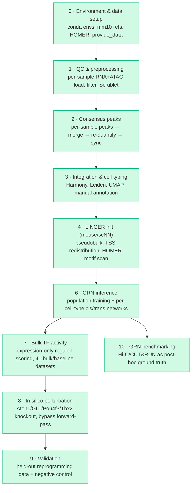

# LINGER Cochlear GRN Pipeline

A reproducible Snakemake workflow that builds mouse cochlear gene regulatory
networks (GRNs) from paired single-cell multiome (RNA+ATAC) data using
[LINGER](https://github.com/Durenlab/LINGER), then uses those networks to
simulate transcription-factor knockouts relevant to hair-cell regeneration
and cochlear aging.

The pipeline takes 10x multiome libraries from four mouse cochlea samples
through QC, consensus peak calling, batch integration and cell typing,
LINGER initialisation, and per-cell-type GRN inference — then layers on
bulk RNA-seq TF-activity scoring, in silico TF perturbation, validation
against held-out reprogramming data, and GRN benchmarking against
independent Hi-C/CUT&RUN ground truth. Everything runs on the University
of Edinburgh's Eddie (SGE) HPC cluster via Snakemake's SGE executor.

**Status as of 2026-09-13: all ten stages have run on real Eddie data at
least once.** Modules 9 and 10 surfaced two genuine result-correctness bugs
this session (not just infrastructure failures) — see
[Development log](#development-log) — and Module 9's validation numbers
are real but currently weak on three of the four checks, which is a
scientific finding worth sitting with, not an unfinished-pipeline problem.

---

## Pipeline overview



**Legend:** green = run end-to-end on real data at least once. See the
status table below for per-module caveats — "run" doesn't mean every
result is strong (Module 9 in particular has real, weak validation
numbers on three of four checks).

Module 5 (chromatin priors) is not a separate pipeline stage — see
[Design notes](#design-notes).

| Stage | Rule file | Tool(s) | Purpose | Status |
|---|---|---|---|---|
| 0 | *(manual)* | conda, HOMER, `setup_linger.sh` | Conda envs, mm10 references, LINGER pretrained weights, HOMER + mm10 genome package | ✅ Done |
| 1 | `01_qc_preprocessing.smk` | Scanpy, Scrublet | Per-sample RNA+ATAC load, QC filtering, doublet detection | ✅ Done |
| 2 | `02_consensus_peaks.smk` | bedtools, SnapATAC2 | Consensus peak set, re-quantification, RNA/ATAC barcode sync, sanity checks | ✅ Done |
| 3 | `03_integration_celltyping.smk` | Harmony, Leiden, UMAP | Batch integration, clustering, marker scoring, **manual** cell-type labelling — 16 annotated cell types | ✅ Done |
| 4 | `04_linger_init.smk` | LINGER (`scNN`), HOMER | Pseudobulking, TSS redistribution, motif scanning against `MotifTarget.bed` | ✅ Done |
| 6 | `06_grn_inference.smk` | LingerGRN (`LL_net`, `LINGER_tr`) | Population-level training + per-cell-type cis/trans regulatory networks, 16 cell types | ✅ Done — `module6_all` completed clean after 3 real bugs fixed |
| 7 | `07_bulk_tf_activity.smk` | LingerGRN (`TF_activity`) | Expression-only TF activity, 41 datasets (37 bulk + 4 baseline) | ✅ Done — `tf_activity_summary.tsv` produced, 586 TFs |
| 8 | `08_perturbation.smk` | Direct `{chr}_net.pt` forward-pass (bypasses `perturb.py`, see Design notes) | Atoh1/Gfi1/Pou4f3 (single + triple) and Tbx2 knockout simulation | ✅ Done — sanity check median ρ = 0.797, `module8_all` run |
| 9 | `09_validation.smk` | scipy, scikit-learn | Correlation + AUROC/AUPR vs. held-out reprogramming/aging data + negative control | ✅ Done — real numbers now (2 result-correctness bugs fixed this session); results are weak on 3/4 checks, see below |
| 10 | `10_grn_benchmarking.smk` | bedtools, scikit-learn | AUROC/AUPR of inferred edges vs. Hi-C/CUT&RUN ground truth | ✅ Done — `benchmark_report.tsv` produced across 16 cell types |

All ten rule files are included in the `Snakefile` and have each been run
end-to-end on real Eddie data at least once. Modules 6-10 are deliberately
NOT part of `rule all` — same convention as Module 6's existing
`module6_all` target, since each depends on real upstream output existing,
not just its rule being defined. Run each stage's own `_all` target — see
[Usage](#usage).

See [Development log](#development-log) for the bugs found and fixed
getting each module from "built" to "run clean," and
[Key outputs](#key-outputs) for where the real result files land.

---

## Repository structure

```
.
├── Snakefile                        # entry point; includes rule modules 1-4,6; defines rule all
├── README.md
├── SETUP.md                          # detailed Eddie setup walkthrough
├── config/
│   └── config_eddie.yaml             # all paths, sample manifest, per-rule SGE resources
├── profiles/
│   └── eddie/config.yaml             # Snakemake SGE executor profile (used in-repo, no copying needed)
├── envs/
│   ├── linger_preproc.yaml           # Modules 1-3 conda env spec
│   └── linger.yaml                   # Modules 4/6/7/8 env spec — reference only, see Requirements
├── setup_linger.sh                   # one-time: conda envs, mm10 refs, HOMER, LINGER weights/provide_data
├── download_datasets.sh              # one-time: pulls + auto-extracts all GEO accessions
├── patch_LL_net_RE_ordering.py       # one-time idempotent patch for a real bug in installed LingerGRN
├── patch_LL_net_cis_reg_load.py      # one-time idempotent patch for a second real bug in installed LingerGRN
└── workflow/
    ├── rules/                        # 01_qc_preprocessing.smk … 10_grn_benchmarking.smk
    └── scripts/                      # per-rule Python helper scripts
```

All ten rule files (`01_qc_preprocessing.smk` … `10_grn_benchmarking.smk`)
are merged into `workflow/rules/` and included from `Snakefile` — see
[Usage](#usage) for how to run each stage.

---

## Requirements

### Software (via conda)

Three separate conda environments — Modules 1–3 build theirs automatically
via `--use-conda`; the LINGER env is pre-built once by `setup_linger.sh`
and reused by direct path, not rebuilt per run:

| Environment | Key contents | Why isolated |
|---|---|---|
| `snakemake_eddie` (orchestrator, self-created) | Python ≥3.11, `snakemake`, `snakemake-executor-plugin-sge`, `conda≥24.7.1` | Runs the `snakemake` CLI itself. Modern Snakemake requires Python ≥3.11, which conflicts with `linger_preproc`'s pinned 3.10 — must be a separate env, never used to run analysis code |
| `linger_preproc` (`envs/linger_preproc.yaml`, built by Snakemake) | scanpy≥1.10, anndata≥0.10, snapatac2==2.9.0, harmonypy≥0.0.10,<0.1.0, leidenalg, scrublet, bedtools | Modules 1–3's single-cell + ATAC stack |
| `LINGER` (pre-built by `setup_linger.sh`, reused by absolute path) | scanpy==1.9.5, anndata==0.9.2, scipy==1.11.3, `LingerGRN` (see version note below), rpy2, pytorch | Modules 4/6/7/8. Exact pins arrived at by trial and error to avoid an anndata/scipy conflict — kept isolated and never rebuilt from `envs/linger.yaml` (kept as documentation only) |

> **Unresolved version-pin discrepancy, flagged rather than silently
> picked:** `setup_linger.sh` and `envs/linger.yaml` both install and pin
> `LingerGRN==1.105`. But `grn_population_training.py` and
> `grn_celltype_specific.py`'s own docstrings, plus the working plan doc,
> both say "real LingerGRN==1.110 calls, confirmed from source" (pulled
> directly from PyPI during Module 6/7 debugging). One of these is stale —
> either the real Eddie `LINGER` env ended up with 1.110 (e.g. `--no-deps`
> resolved differently at install time than the pin implies) and
> `setup_linger.sh` needs its pin bumped to match, or the docstrings are
> wrong and should cite 1.105. Confirm with `pip show LingerGRN` in the
> real env before trusting either document over the other.

### Manual post-install steps

- **HOMER mm10 genome package** — hard prerequisite for Module 4
  (`linger_motif_scan` calls `annotatePeaks.pl` directly):
  ```bash
  qsub <WORK_DIR>/homer_mm10_install.sh
  perl <WORK_DIR>/homer/configureHomer.pl -list | grep mm10   # expect: +  mm10  v7.0
  ```
- **`provide_data` (GRNdir)** — LINGER's reference bundle (motif matches,
  TSS coordinates), downloaded by `setup_linger.sh`.

### Reference data (downloaded automatically by `setup_linger.sh`)

mm10 genome FASTA + GTF, `mm10.chrom.sizes`, LINGER pretrained weights,
JASPAR motifs (unused by the `scNN` code path actually taken, but
downloaded as part of the standard setup).

---

## Configuration

Edit `config/config_eddie.yaml`:

| Key | Should point to |
|---|---|
| `multiome_root` | `<cochlear_datasets>/01_multiome` |
| `chrom_root` | `<cochlear_datasets>/02_chromatin_priors` |
| `scratch` | Pipeline output root, e.g. `<linger_pipeline>/preprocessed` |
| `references.mm10_chrom_sizes` | `<linger_pipeline>/references/mm10/mm10.chrom.sizes` |
| `linger.grn_dir` | `provide_data/provide_data` |
| `linger.conda_env_linger` | Absolute path to your pre-built `LINGER` conda env |

**Gotcha worth knowing:** `module load anaconda` on Eddie loads the
group-managed anaconda install first, which takes precedence over a
personal `envs_dirs` redirect — so `LINGER` and other envs can land under
the group path (`/exports/csce/eddie/biology/groups/.../envs/<user>/...`)
rather than where `setup_linger.sh` intends. After any fresh setup, run
`conda env list | grep LINGER` and update `conda_env_linger` if the path
differs from the config.

`samples:` / `extra_bulk_rna_inputs:` / `extra_chromatin_prior_inputs:`
mirror `sample_config.py` — no edits needed unless `SAMPLES` membership
itself changes.

---

## Usage

### 1. Environment setup and data download (run in parallel)

```bash
# Session 1 — conda envs, mm10 refs, HOMER core, LINGER weights/provide_data
qlogin -l h_vmem=8G -l h_rt=04:00:00
module load anaconda
bash /exports/eddie/scratch/<user>/setup_linger.sh \
     /exports/eddie/scratch/<user>/linger_pipeline

# Session 2 — GEO downloads (login node, no qlogin needed; auto-extracts
# all .tar bundles inline, no manual tar loop required)
bash /exports/eddie/scratch/<user>/download_datasets.sh \
     /exports/eddie/scratch/<user>/cochlear_datasets
```

### 2. HOMER mm10 genome package

```bash
qsub /exports/eddie/scratch/<user>/linger_pipeline/homer_mm10_install.sh
perl /exports/eddie/scratch/<user>/linger_pipeline/homer/configureHomer.pl -list | grep mm10
```

### 3. Get the repo onto Eddie

```bash
scp -r LINGER-Cochlear-TF-Knockout-Pipeline-master \
    <user>@eddie.ecdf.ed.ac.uk:/exports/eddie/scratch/<user>/linger_pipeline/code
```

### 4. Orchestrator env (one-time)

```bash
conda create -n snakemake_eddie python=3.11
conda activate snakemake_eddie
conda install -c conda-forge "conda>=24.7.1"
pip install snakemake snakemake-executor-plugin-sge
```

> **Don't `conda install` anything else into this env** (e.g. `scanpy`) —
> it exists only to run the `snakemake` CLI. A solver-driven install here
> can silently shift versions `snakemake` itself depends on. Analysis code
> (reading `.h5ad`, checking cluster markers, etc.) belongs in
> `linger_preproc`, which is also the env that actually produced those
> files.

### 5. Pre-build the Modules 1–3 conda env

```bash
cd /exports/eddie/scratch/<user>/linger_pipeline/code
conda activate snakemake_eddie
snakemake --use-conda --conda-frontend conda --conda-create-envs-only --cores 1
```

### 6. Dry run

```bash
snakemake --profile profiles/eddie --use-conda --conda-frontend conda \
    --rerun-incomplete --keep-going --latency-wait 60 -n
```

### 7. Run Modules 1–3

```bash
tmux new-session -s linger_run
cd /exports/eddie/scratch/<user>/linger_pipeline/code
conda activate snakemake_eddie
snakemake --profile profiles/eddie --use-conda --conda-frontend conda \
    --rerun-incomplete --keep-going --latency-wait 60 \
    > /exports/eddie/scratch/<user>/linger_pipeline/preprocessed/snakemake_run.log 2>&1 &
```
Detach with `Ctrl-b d`; monitor with `qstat` and `tail -f snakemake_run.log`.
Check `module1_summary.csv`, `qc_sanity_checks/sanity_summary.csv`,
`module3_integration/cluster_umap.png` when it finishes.

### 8. Manual step: cell-type labels

```bash
# 1. Review cluster_umap.png + cluster_marker_scores.csv (Myo7a, Pou4f3,
#    Gfi1, Slc26a5, Sox2, Hes1 per cluster)
# 2. Copy module3_integration/cluster_template.tsv -> cluster_annotation.tsv
# 3. Fill in the cell_type column for every leiden row, then:
snakemake --profile profiles/eddie --use-conda --conda-frontend conda \
    --rerun-incomplete --keep-going --latency-wait 60 \
    <scratch>/module3_integration/cluster_marker_scores.csv \
    <scratch>/module3_integration/cluster_umap.png \
    <scratch>/module3_integration/labeled.h5ad
```

### 9. Module 4 — LINGER initialisation

```bash
snakemake --profile profiles/eddie --use-conda --conda-frontend conda \
    --rerun-incomplete --keep-going --latency-wait 60 \
    <scratch>/module4_linger_init/tss_redist.done \
    <scratch>/module4_linger_init/MotifTarget.bed
```

### 10. Module 6 — GRN inference (current stage)

```bash
snakemake --profile profiles/eddie --use-conda --conda-frontend conda \
    --rerun-incomplete --keep-going --latency-wait 60 module6_all
```
If a retry is needed after a fix, delete the relevant `.done` marker first
(e.g. `population_training.done`) — see
[Development log](#development-log) for the fixes applied so far.

### 11. Module 7 — bulk TF activity (once Module 6 is clean)

```bash
snakemake --profile profiles/eddie --use-conda --conda-frontend conda \
    --rerun-incomplete --keep-going --latency-wait 60 module7_all
```

### 12. Module 8 — in silico perturbation

**Run the sanity check first and read its log before trusting anything
else from this module** — see [Design notes](#design-notes) for why:

```bash
snakemake --profile profiles/eddie --use-conda --conda-frontend conda \
    --rerun-incomplete --keep-going --latency-wait 60 \
    <scratch>/module8_perturbation/_sanity_check_baseline_predicted.tsv
tail -30 <scratch>/logs/08b_sanity_check.log   # read the SANITY CHECK block
```

If the median Spearman rho reported there is clearly positive (not near
zero), proceed:

```bash
snakemake --profile profiles/eddie --use-conda --conda-frontend conda \
    --rerun-incomplete --keep-going --latency-wait 60 module8_all
```

### 13. Module 9 — validation against held-out data

```bash
snakemake --profile profiles/eddie --use-conda --conda-frontend conda \
    --rerun-incomplete --keep-going --latency-wait 60 module9_all
```

### 14. Module 10 — GRN benchmarking (no dependency on 7-9)

```bash
snakemake --profile profiles/eddie --use-conda --conda-frontend conda \
    --rerun-incomplete --keep-going --latency-wait 60 benchmark_grn_edges
```

---

## Key outputs

All outputs are written under `{scratch}/`, never into the repository:

| Output | Path pattern |
|---|---|
| Per-sample QC summary | `module1_summary.csv` |
| Consensus peak set | `consensus_peaks.bed` |
| QC sanity check summary | `qc_sanity_checks/sanity_summary.csv` |
| Cluster UMAP + marker scores | `module3_integration/cluster_umap.png`, `cluster_marker_scores.csv` |
| Labelled, integrated AnnData | `module3_integration/labeled.h5ad` |
| LINGER motif scan output | `module4_linger_init/MotifTarget.bed` |
| Per-cell-type GRNs | `module6_grn/{celltype}.done` (cis/trans regulatory matrices) |
| TF activity scores | `module7_tf_activity/tf_activity_summary.tsv` |
| Perturbation sanity check | `module8_perturbation/_sanity_check_baseline_predicted.tsv` (+ log — READ THIS FIRST) |
| Knockout predictions | `module8_perturbation/{ko_id}_predicted_expression.tsv` |
| Validation report | `module9_validation/validation_report.tsv` (correlation + AUROC/AUPR + pass/fail per held-out check) |
| GRN benchmark report | `module10_benchmarking/benchmark_report.tsv` (AUROC/AUPR vs. Hi-C/CUT&RUN) |

---

## Results snapshot (2026-09-13 run)

Real numbers from the current output files, kept here so the README
doesn't just say "done" without showing what that means:

- **Module 3** — 16 annotated cell types across 29 Leiden clusters, ~13k
  cells; three GSE224563/GSE182202 batches integrate cleanly with no
  strong batch-driven substructure in the UMAP.
- **Module 8 sanity check** — median Spearman ρ = **0.797** (mean 0.668,
  80% of 23,082 genes above ρ>0.3) between the reconstructed-order forward
  pass and real pseudobulk expression — clearly positive, so the
  `PYTHONHASHSEED`-dependent TF-ordering risk flagged in
  [Design notes](#design-notes) did not materialise for this run. Real
  knockout output is trusted on this basis.
- **Module 9 validation** — of four checks with a real ground truth:
  - `atoh1_gfi1_pou4f3_overexpression` (GSE224627): **PASS** (ρ=0.44, AUROC=0.77)
  - `tbx2_conversion` (GSE233559): **FAIL** (ρ=−0.60, AUROC=0.75 — note the
    sign: AUROC alone looks fine, but the correlation runs the wrong
    direction once sign-adjusted for the gain-of-function comparison)
  - `negative_control_must_not_reprogram` (GSE281207): **FAIL** — the
    control shows about as strong a signal (ρ=0.72) as the real positive
    checks, meaning the model isn't cleanly discriminating "should
    reprogram" from "shouldn't"
  - `aging_vector_support` (3 usable datasets vs. the GSE274279 reference
    vector): all three near zero/non-significant (ρ = −0.02, −0.07, 0.15)
    — the aging-shift prediction doesn't externally validate by this
    metric yet.

  **Read this as a real, partially negative result, not a broken
  pipeline** — the numbers only became trustworthy this session once two
  genuine bugs were fixed (see [Development log](#development-log)); the
  pipeline was previously hiding this outcome behind a hardcoded `1.0`.
- **Module 10 benchmarking** — `cis_RE_TG` vs. Hi-C loops sits at
  AUROC 0.51–0.52 across all 16 cell types (same edge universe per
  cell type, only the score column varies — expected, not a bug, but a
  genuinely weak signal). `TF_RE_binding` vs. CUT&RUN varies meaningfully
  by cell type and TF: Atoh1 AUROC 0.58–0.78, Pou4f3 AUROC 0.53–0.66
  (both wild-type and MEF-reprogramming ground truth) — a real,
  celltype-sensitive signal, unlike the cis edges.

---

## Design notes

- **Three-environment split.** The orchestrator (`snakemake_eddie`), the
  Modules 1–3 stack (`linger_preproc`), and the pre-built `LINGER` env are
  kept fully isolated because LINGER's exact pins
  (`scanpy==1.9.5`/`anndata==0.9.2`/`LingerGRN==1.105 --no-deps`) conflict
  with the newer stack Modules 1–3 need — mixing them breaks `import
  LingerGRN` or produces subtly different clustering/marker output.
- **`LINGER` env is activated by path, not built from a spec.** Module
  4/6/7/8 rules point `conda:` at an absolute env directory
  (`config["linger"]["conda_env_linger"]`) rather than a `.yaml` file.
  Snakemake's `deployment/conda.py` treats an existing local directory as
  `CondaEnvDirSpec` and activates it directly — `envs/linger.yaml` is kept
  for documentation only.
- **Two mouse-incompatible code paths avoided.** LINGER's full
  atlas-pretrained `'LINGER'` method is hardcoded to hg19/hg38 throughout;
  `method='scNN'` is the only mode with native mouse support and is what
  every rule here uses. This is also why Module 8 bypasses `perturb.py`
  entirely — see the next bullet.
- **Module 8 reimplements the forward pass directly, rather than using
  `LingerGRN.perturb`.** `perturb.py`'s `load_data_ptb()`/`get_simulation()`
  were written for the human/hg19/hg38 `'LINGER'` method's file/index
  scheme and are confirmed structurally incompatible with `scNN` in three
  independent ways: a hardcoded human chr1-22+X chromosome list; a
  `Target`/`data_merge` row-count assumption that `scNN`'s RE-linked gene
  subset violates; and an explicit-index TF/RE gather scheme that doesn't
  match `scNN` training's real implicit "all TFs except self" scheme
  (confirmed against `LINGER_tr.sc_nn_NN()`, the function that actually
  trained `{chr}_net.pt`). A compatibility shim was considered and
  rejected — it would mean reimplementing `sc_nn_NN`'s real input contract
  anyway, then re-encoding it into a format with those three extra bugs.
  `workflow/scripts/linger_perturbation.py` reimplements the forward pass
  directly against `{chr}_net.pt`, modeled on `sc_nn_NN` itself. **One
  real, unresolved risk carries over from this design:** the TF ordering
  each gene's trained net expects depends on a Python `set()` intersection
  (`LINGER_tr.load_data_scNN()`'s `TFlist` construction) whose order is
  process-dependent unless `PYTHONHASHSEED` was fixed at training time —
  that order was never persisted to disk in `scNN` mode. This can't be
  retroactively recovered with certainty; `linger_perturbation_sanity_check`
  (Module 8's first rule) is the only real check available for it — its
  log reports predicted-vs-real correlation on the *unperturbed* pseudobulk
  profile, and a result near zero means don't trust knockout output from
  this module until investigated further. See
  `workflow/scripts/prep_pseudobulk_target.py` and
  `workflow/scripts/linger_perturbation.py`'s docstrings for the full
  detail.
- **No Module 8 overexpression mode.** Module 9's positive checks compare
  Module 8's *knockout* predictions directly against real overexpression/
  conversion ground truth (sign-adjusted where the held-out data represents
  gain-of-function against a loss-of-function simulation) — per the plan
  doc's own Module 9 spec — rather than needing a second, separately-built
  gain-of-function simulation mode.
- **`os.chdir()` workaround for hardcoded relative paths.** `LINGER_tr.get_TSS()`
  and `RE_TG_dis()` read/write hardcoded `./data/...` paths regardless of
  their `outdir` argument — scripts `chdir()` into a shared per-run workdir
  rather than patching LINGER itself.
- **Cell-type labels are a hard pseudobulking prerequisite.**
  `pseudo_bulk.pseudo_bulk()` requires cell-type labels *before*
  pseudobulking, so Module 4 depends on `labeled.h5ad`, not `integrated.h5ad`.
- **Module 5 (chromatin priors) folded into Module 10.** Hi-C/CUT&RUN
  aren't a native LINGER inference-time input — no ingestion path exists
  in `preprocess.py`/`LL_net.py`/`LINGER_tr.py`. Decided to use them purely
  as post-hoc benchmarking ground truth (Module 10) rather than as
  inference-time constraints; post-hoc edge reweighting and
  training-loop-regularization approaches were considered and deferred.

---

## Development log

**Module 6 (GRN inference) — real bugs found running against actual Eddie
data**, none visible from reading LINGER's source alone:
- `GRNdir` needed a trailing slash (LINGER concatenates paths as raw
  strings) — fixed in both Module 6 scripts.
- PyTorch 2.6+'s `weights_only=True` default broke unpickling LINGER's own
  saved models — fixed with a `torch.load` monkeypatch.
- Two real bugs in the installed `LingerGRN` package's single-celltype
  `scNN` branches (`cell_type_specific_TF_RE_binding`'s `RE`-before-assignment
  ordering bug; `cell_type_specific_cis_reg`'s missing `load_RE_TG_scNN()`
  call) — fixed via the two `patch_LL_net_*.py` scripts at the repo root.
- Manually-authored cell-type labels containing commas/slashes/parentheses
  broke Snakemake's own SGE array-job wildcard parsing — fixed by
  sanitizing `cluster_annotation.tsv` and rebuilding `labeled.h5ad`.
- `grn_population_training.py` was missing population-level
  `cis_reg()`/`trans_reg()` calls, needed by both Module 7 and (it turned
  out) Module 6's own celltype step — fixed; `population_training.done`
  deleted and `module6_all` re-run.
- Memory grants bumped (32GB → 48GB) after a real run hit 96% of the old
  grant; a training-resume guard was added so a late-stage failure doesn't
  force a ~4h retrain.
- `module6_all` (`retry10`) **completed clean** — all 16 `linger_celltype_grn`
  array tasks plus population training finished with no error, confirmed
  via `.done` marker count and the population-level `cell_population_{cis,
  trans}_regulatory.txt` outputs Module 7 depends on.

**Module 7 (bulk TF activity) — completed, after a real multi-session
loader debugging effort.** Built against the real installed `LingerGRN`
source; caught one bug before running (`network="general"` routes through
an hg19/hg38-only function with no mm10 branch, corrected to
`network="cell population"`). `model_construction_refs` (6 GEO accessions)
resolved to route here, not Module 6/4, since `TF_activity.regulon()` is
the only RNA-only-input function in the package. `bulk_rna_loader.py`'s
generic format auto-detection then needed real, dataset-specific fixes
across two debugging rounds: `symbol_column` overrides for ~10 datasets
whose gene-identifier column wasn't the DataFrame index LINGER expects
(Ensembl-vs-symbol or a named non-index column), `openpyxl`/`xlrd` added
for real `.xlsx`/legacy `.xls` inputs, and `GSE83599`/`GSE135703_adult_SC`/
`GSE266157`/`GSE111349_sorted_ihc_ohc` excluded (no usable symbol data,
confirmed by direct inspection, not assumed). Final run: **41 datasets**
(37 bulk + 4 baseline), 586 TFs, `module7_aggregate` completed.

**Module 8 (in silico perturbation) — resolved 2026-09-08, bypass chosen.**
Was blocked on a real API gap: `perturb.load_data_ptb()`'s four required
input files are only ever written by LINGER's human/hg19/hg38 training
path, never the mouse-compatible `scNN` path this project uses. Checked
LINGER's own GitHub docs before deciding, per the plan's own cheapest-first
ordering: `docs/perturb.md` (the perturbation tutorial) is entirely
human/hg19 (H1 cell line, `data_bulk/`); `docs/scNN.md` (the mouse/"other
species" tutorial) walks through population/cell-type GRN inference and TF
activity, then stops — no perturbation section exists in the mouse
tutorial at all. No GitHub issue found addressing mouse-mode perturbation
either. That ruled out "look for a working example" definitively. Reading
`perturb.py`'s and `LINGER_tr.py`'s real source in full then ruled out a
compatibility shim too — it has three of its own bugs (see Design notes)
beyond the already-known filename mismatch, on top of needing `scNN`'s
real input contract reimplemented anyway. Built as a direct bypass instead
(`08_perturbation.smk`, `linger_perturbation.py`,
`prep_pseudobulk_target.py`), modeled on `LINGER_tr.sc_nn_NN()` — the real
function that trained `{chr}_net.pt` — not on `perturb.py`. Carries one
flagged, unresolved risk (TF-ordering nondeterminism) with a built-in
sanity-check rule to surface it before trusting real knockout output — see
Design notes for the full explanation. Also found, in the same source
read: a real cyclic-dependency bug in `06_grn_inference.smk`'s
`linger_celltype_grn` rule (`{celltype}.done`'s wildcard could ambiguously
match `population_training.done` itself) — fixed with an explicit
`wildcard_constraints` block, confirmed via a real `snakemake -n` dry-run
that surfaced it while integrating Module 7. **Sanity check run 2026-09-10:
median Spearman ρ = 0.797** (23,082 genes, 80% above ρ>0.3) — clearly
positive, so the flagged TF-ordering risk did not materialise; `module8_all`
run for real on this basis.

**Module 9 (validation) — built 2026-09-08, two real result-correctness
bugs found and fixed 2026-09-13.** Per-check logic in
`09_validation.smk`'s `CHECK_SPECS`: the two reprogramming checks
(`atoh1_gfi1_pou4f3_overexpression`, `tbx2_conversion`) compare a named
Module 8 knockout prediction against each held-out dataset's real
expression shift relative to Module 4's population pseudobulk baseline
(sign-flipped for the overexpression check, since it's a gain-of-function
comparison against a loss-of-function simulation); the four aging checks
diff Module 7's `role="baseline"` mean TF activity against each aging
dataset's own TF activity; the negative control reuses the reprogramming
machinery with inverted pass/fail logic. Output is both Spearman
correlation and AUROC/AUPR, per the plan doc's explicit Module 9 output
spec, reusing Module 10's existing AUROC/AUPR approach rather than
inventing a new metric. Flagged, not silently assumed: exactly which
samples within each held-out dataset represent "converted" vs baseline
isn't specified anywhere upstream — this uses each dataset's overall mean
expression, worth revisiting against real per-condition labels if a
dataset has them.

**Bug 1 — hardcoded self-correlation on every aging check, found
2026-09-13.** The original `aging_tf_activity` branch set
`predicted_shift = real_shift` (literally the same object) and hardcoded
`rho, pval = 1.0, 0.0` rather than computing anything — every aging
dataset reported an identical, fabricated "perfect" correlation. Root
cause was a real design gap, not just a coding slip: the plan doc names
`GSE274279` **"ground truth for aging vector"** and the other four
**"aging-vector-support"**, meaning the four support datasets should be
scored against `GSE274279`'s real shift vector, not against themselves.
Fixed by splitting `aging_tf_activity` into two roles
(`check_spec["aging_role"]`): `validate_aging_vector` computes and writes
out `GSE274279`'s real shift as a genuine Snakemake output; the four
`validate_aging_support` jobs declare that file as a real input and
Spearman-correlate / AUROC-score their own shift against it.

**Bug 2 — silent NaN propagation, found immediately after fixing Bug 1.**
Once real correlations were being computed, `GSE196870_SNHL` crashed
`roc_auc_score` with `ValueError: Input contains NaN`. Traced to
`bulk_rna_loader.py`: this dataset's gene-identifier column is a plain
Ensembl ID (column 0), with real gene symbols in a separately-named
`gene` column that `_coerce_numeric_columns()` correctly drops as
non-numeric "sample" data but which was never promoted to `var_names` —
so 0/586 TFs overlapped the GRN's symbol space and every activity score
came back NaN. Fixed with `symbol_column: gene` on this one config entry
(same mechanism already used for ~10 other datasets). Separately hardened
both `_auroc_aupr()` and the `spearmanr()` call sites to explicitly drop
NaN entries with a visible log line instead of relying on
`scipy`'s silent `nan_policy='propagate'`, which had been masking the same
class of problem without surfacing it.

**Real result, not further debugged away:** of the four checks with a
real external comparison, one passes
(`atoh1_gfi1_pou4f3_overexpression`, ρ=0.44) and three don't
(`tbx2_conversion` FAILs on sign; the negative control FAILs by scoring
almost as strongly as the real positive checks; all three usable
`aging_vector_support` datasets sit at ρ≈0, non-significant or barely
significant with a tiny effect size). This is the pipeline correctly
reporting a real, partially negative validation outcome — worth treating
as a scientific finding about the model's discriminative power and aging
extrapolation, not as a bug to keep chasing.

**Module 10 (GRN benchmarking) — built 2026-09-05, run 2026-09-13 after
one resourcing and two data fixes.** Built as a bespoke bedtools-intersect
+ AUROC/AUPR script, since `LingerGRN.Benchmk.bm_trans()` expects a
ChIP-seq ranked-gene-list ground truth, not chromatin-interaction data. No
dependency on Modules 8/9. Integrated into the Snakefile 2026-09-08
alongside Modules 7-9. Two prior-data fixes on 2026-09-11:
`GSE150391_cutrun_pou4f3` split into two separately-scored contexts
(`_wt_hc` native binding vs. `_mef_reprogram` reprogramming binding, each
pinned to real GSM accessions via `file_glob` rather than an
alphabetical-first-match guess); `GSE181307_cutrun` marked `role: skip`
after confirming its directory holds only bigWig signal tracks, no called
peaks. The added per-context work pushed `benchmark_grn_edges` past its
90-minute runtime grant on 2026-09-13 (job killed by the SGE wall clock,
not a Python exception — confirmed via an empty log and a `.error` file
with no traceback); fixed by bumping `runtime_min` to 360, no code change
needed. **Real result:** `cis_RE_TG` vs. Hi-C loops is flat and
near-chance (AUROC 0.51–0.52) across all 16 cell types — expected given
the edge universe is fixed at the population level and only the score
column is cell-type-specific, confirmed by diffing the RE column across
two cell types' output files. `TF_RE_binding` vs. CUT&RUN varies
meaningfully by cell type (Atoh1 AUROC 0.58–0.78, Pou4f3 0.53–0.66), a
genuine signal.

---

## Tools & citations

This pipeline orchestrates the following third-party tools. If you use it,
please cite them alongside this repository:

- **LINGER** — Yuan Q, Duren Z. Integration of single-cell multi-omic data
  to infer gene regulatory networks via LINGER. *Nat Biotechnol*. 2025.
  doi: [10.1038/s41587-024-02182-7](https://doi.org/10.1038/s41587-024-02182-7)
- **Snakemake** — Mölder F, et al. Sustainable data analysis with Snakemake.
  *F1000Research*. 2021;10:33. doi: [10.12688/f1000research.29032.2](https://doi.org/10.12688/f1000research.29032.2)
- **HOMER** — Heinz S, et al. Simple combinations of lineage-determining
  transcription factors prime cis-regulatory elements required for
  macrophage and B cell identities. *Mol Cell*. 2010;38(4):576–589.
  doi: [10.1016/j.molcel.2010.05.004](https://doi.org/10.1016/j.molcel.2010.05.004)
- **Harmony / harmonypy** — Korsunsky I, et al. Fast, sensitive and accurate
  integration of single-cell data with Harmony. *Nat Methods*. 2019;16(12):1289–1296.
  doi: [10.1038/s41592-019-0619-0](https://doi.org/10.1038/s41592-019-0619-0)
- **Scanpy** — Wolf FA, Angerer P, Theis FJ. SCANPY: large-scale single-cell
  gene expression data analysis. *Genome Biol*. 2018;19:15.
  doi: [10.1186/s13059-017-1382-0](https://doi.org/10.1186/s13059-017-1382-0)
- **SnapATAC2** — Zhang K, et al. SnapATAC2: a fast, scalable and versatile
  tool for analysis of single-cell chromatin accessibility data.
  *Nat Methods*. 2024. doi: [10.1038/s41592-023-02139-9](https://doi.org/10.1038/s41592-023-02139-9)
- **Leiden / python-igraph** — Traag VA, Waltman L, van Eck NJ. From Louvain
  to Leiden: guaranteeing well-connected communities. *Sci Rep*. 2019;9:5233.
  doi: [10.1038/s41598-019-41695-z](https://doi.org/10.1038/s41598-019-41695-z)
- **bedtools** — Quinlan AR, Hall IM. BEDTools: a flexible suite of utilities
  for comparing genomic features. *Bioinformatics*. 2010;26(6):841–842.
  doi: [10.1093/bioinformatics/btq033](https://doi.org/10.1093/bioinformatics/btq033)

---

## Author

Darren Lim Jia Sheng (DarrenLJS)

## License

TODO
Released under the MIT License — free to use, modify, and redistribute
with attribution.
