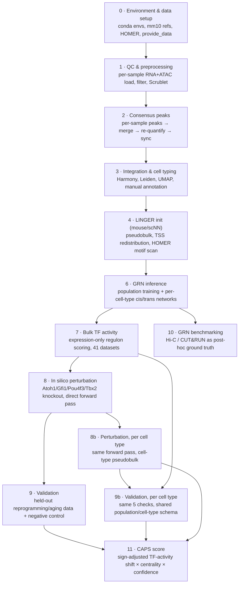

# LINGER Cochlear GRN Pipeline

A reproducible Snakemake workflow that builds mouse cochlear gene regulatory
networks (GRNs) from paired single-cell multiome (RNA + ATAC) data using
[LINGER](https://github.com/Durenlab/LINGER), then uses those networks to
simulate transcription-factor (TF) knockouts relevant to hair-cell
regeneration and cochlear aging.

The pipeline takes 10x multiome libraries from four mouse cochlea samples
through QC, consensus peak calling, batch integration, cell typing, LINGER
initialisation and GRN inference (population-level and per cell type). On top
of those networks it adds bulk RNA-seq TF-activity scoring, in silico TF
knockouts, validation against held-out reprogramming and aging data,
benchmarking against independent Hi-C / CUT&RUN data, and a combined
**CAPS** (Cochlear Aging Perturbation Score) ranking. The perturbation,
validation and CAPS stages each run at population level and per cell type.
Everything runs on the University of Edinburgh's Eddie (SGE) HPC cluster via
Snakemake's SGE executor.

**Status:** all modules (0–11) have run end-to-end on real data. Validation
results are mixed. See [Current results](#current-results) and
[Known issues and limitations](#known-issues-and-limitations).

For first-time installation on Eddie, follow **[SETUP.md](SETUP.md)**. For
figure generation, see `results/scripts/README.md` in the companion figure
pipeline.

---

## Contents

- [Pipeline overview](#pipeline-overview)
- [Repository structure](#repository-structure)
- [Requirements](#requirements)
- [Configuration](#configuration)
- [Usage](#usage)
- [Key outputs](#key-outputs)
- [Current results](#current-results)
- [Design notes](#design-notes)
- [Known issues and limitations](#known-issues-and-limitations)
- [Changelog](#changelog)
- [Tools and citations](#tools-and-citations)
- [Author](#author)
- [License](#license)

---

## Pipeline overview


```mermaid
flowchart TD
    A["0 · Environment & data setup<br/>conda envs, mm10 refs, HOMER, provide_data"] --> B["1 · QC & preprocessing<br/>per-sample RNA+ATAC load, filter, Scrublet"]
    B --> C["2 · Consensus peaks<br/>per-sample peaks → merge → re-quantify → sync"]
    C --> D["3 · Integration & cell typing<br/>Harmony, Leiden, UMAP, manual annotation"]
    D --> E["4 · LINGER init (mouse/scNN)<br/>pseudobulk, TSS redistribution, HOMER motif scan"]
    E --> F["6 · GRN inference<br/>population training + per-cell-type cis/trans networks"]
    F --> G["7 · Bulk TF activity<br/>expression-only regulon scoring, 41 datasets"]
    F --> J["10 · GRN benchmarking<br/>Hi-C / CUT&RUN as post-hoc ground truth"]
    G --> H["8 · In silico perturbation<br/>Atoh1/Gfi1/Pou4f3/Tbx2 knockout, direct forward pass"]
    H --> H2["8b · Perturbation, per cell type<br/>same forward pass, cell-type pseudobulk"]
    H --> I["9 · Validation<br/>held-out reprogramming/aging data + negative control"]
    H2 --> I2["9b · Validation, per cell type<br/>same 5 checks, shared population/cell-type schema"]
    G --> I2
    I --> K["11 · CAPS score<br/>sign-adjusted TF-activity shift × centrality × confidence"]
    I2 --> K
    H2 --> K
```

Module 5 (chromatin priors) is not a separate stage; its data is used as
benchmarking ground truth in Module 10 (see [Design notes](#design-notes)).

| Stage | Rule file | Tool(s) | Purpose | Status |
|---|---|---|---|---|
| 0 | *(manual)* | conda, HOMER, `setup_linger.sh` | Conda envs, mm10 references, LINGER reference data, HOMER + mm10 genome package | ✅ Done |
| 1 | `01_qc_preprocessing.smk` | Scanpy, Scrublet | Per-sample RNA+ATAC load, QC filtering, doublet detection, mito/haemoglobin gene removal | ✅ Done |
| 2 | `02_consensus_peaks.smk` | bedtools, SnapATAC2 | Consensus peak set, re-quantification, RNA/ATAC barcode sync, sanity checks | ✅ Done |
| 3 | `03_integration_celltyping.smk` | Harmony, Leiden, UMAP | Batch integration, clustering, marker scoring, **manual** cell-type labelling (22 cell types) | ✅ Done |
| 4 | `04_linger_init.smk` | LINGER (`scNN`), HOMER | Pseudobulking, TSS redistribution, motif scanning (`MotifTarget.bed`) | ✅ Done |
| 6 | `06_grn_inference.smk` | LingerGRN (`LL_net`, `LINGER_tr`) | Population training + per-cell-type cis/trans regulatory networks (22 cell types) | ✅ Done |
| 7 | `07_bulk_tf_activity.smk` | LingerGRN (`TF_activity`) | Expression-only TF activity across 41 datasets (37 bulk + 4 baseline) | ✅ Done — 586 TFs |
| 8 | `08_perturbation.smk` | Direct `{chr}_net.pt` forward pass | Atoh1, Gfi1, Pou4f3 (single + triple) and Tbx2 knockouts, population pseudobulk | ✅ Done — sanity check median ρ = 0.790 |
| 8b | `08b_perturbation_celltype.smk` | Same forward pass | Same 5 knockouts per cell type (20 cell types with ≥ 100 cells) | ✅ Done — per-cell-type sanity ρ 0.08–0.38 |
| 9 | `09_validation.smk` | SciPy, scikit-learn | Spearman ρ + AUROC/AUPR vs held-out data, plus a negative control | ✅ Done — 1 of 3 scored checks passes |
| 9b | `09b_validation_celltype.smk` | Same checks, per cell type | Population and cell-type results under one schema (`scope` column) | ✅ Done — see caveats |
| 10 | `10_grn_benchmarking.smk` | bedtools, scikit-learn | AUROC/AUPR of inferred edges vs Hi-C / CUT&RUN | ✅ Done — 22 cell types |
| 11 | `11_caps_score.smk` | pandas, LingerGRN (`TF_activity`) | CAPS ranking per knockout and scope | ✅ Done — 105 (knockout, scope) rows |

All twelve rule files are included in the `Snakefile`. Modules 6–11 are
deliberately excluded from `rule all`, because each needs real upstream
output on disk, not just its rules defined. Each module is run through its
own target (see [Usage](#usage)).

---

## Repository structure

```
.
├── Snakefile                        # entry point; includes rule files 01–11; defines rule all
├── README.md
├── SETUP.md                         # step-by-step first-time setup on Eddie
├── config/
│   └── config_eddie.yaml            # paths, sample manifest, per-rule SGE resources
├── profiles/
│   └── eddie/config.yaml            # Snakemake SGE executor profile (used in place)
├── envs/
│   ├── linger_preproc.yaml          # Modules 1–3 conda env spec
│   └── linger.yaml                  # LINGER env spec — documentation only (see Requirements)
├── setup_scripts/                   # one-time setup, run outside the Snakemake DAG
│   ├── setup_linger.sh              #   conda envs, mm10 refs, HOMER, LINGER provide_data
│   ├── download_datasets.sh         #   downloads and extracts all GEO accessions
│   ├── download_gold_standard.sh    #   GenAge / CellAge raw tables (provenance for the frozen gold table)
│   ├── patch_LL_net_RE_ordering.py  #   idempotent patch for a bug in installed LingerGRN
│   └── patch_LL_net_cis_reg_load.py #   idempotent patch for a second LingerGRN bug
├── other_helper_scripts/            # one-off inspection/verification scripts, not in the DAG
│   ├── h5ad_breakdown.py            #   per-cluster DE genes + sample composition
│   ├── h5ad_check.py                #   marker expression spot-checks for chosen clusters
│   ├── verify_loader_regression.py  #   regression check for bulk_rna_loader.py changes
│   └── sanity_check_motif_naming.sh #   HOMER PositionID naming check on a 10-peak slice
└── workflow/
    ├── rules/                       # 01_qc_preprocessing.smk … 11_caps_score.smk
    └── scripts/                     # Python helpers called by the rules
```

---

## Requirements

### Conda environments

Three isolated environments are used. The Modules 1–3 environment is built
automatically by Snakemake (`--use-conda`); the LINGER environment is built
once by `setup_linger.sh` and activated by absolute path.

| Environment | Key contents | Used for |
|---|---|---|
| `snakemake_eddie` (created manually) | Python ≥ 3.11, `snakemake`, `snakemake-executor-plugin-sge`, `conda ≥ 24.7.1` | Running the `snakemake` CLI only. Must stay separate: modern Snakemake needs Python ≥ 3.11, while `linger_preproc` is pinned to 3.10 |
| `linger_preproc` (`envs/linger_preproc.yaml`, built by Snakemake) | scanpy ≥ 1.10, anndata ≥ 0.10, snapatac2 == 2.9.0, harmonypy ≥ 0.0.10,< 0.1.0, leidenalg, scrublet, bedtools | Modules 1–3 |
| `LINGER` (built by `setup_linger.sh`) | scanpy == 1.9.5, anndata == 0.9.2, scipy == 1.11.3, `LingerGRN` (`--no-deps`), rpy2, PyTorch | Modules 4 and 6–11. Exact pins avoid an anndata/SciPy conflict; never rebuilt from `envs/linger.yaml` |

### Manual installs

- **HOMER mm10 genome package** — required by Module 4 (`linger_motif_scan`
  calls `annotatePeaks.pl` directly):
  ```bash
  qsub <WORK_DIR>/homer_mm10_install.sh
  perl <WORK_DIR>/homer/configureHomer.pl -list | grep mm10   # expect: +  mm10  v7.0
  ```
- **LINGER `provide_data` (GRNdir)** — motif matches and TSS coordinates,
  downloaded by `setup_linger.sh`.

### Reference data

Downloaded by `setup_linger.sh`: mm10 genome FASTA + GTF, `mm10.chrom.sizes`,
LINGER reference data, and JASPAR motifs (downloaded by the standard setup
but not read by the `scNN` code path).

---

## Configuration

Edit `config/config_eddie.yaml`:

| Key | Should point to |
|---|---|
| `multiome_root` | `<cochlear_datasets>/01_multiome` |
| `chrom_root` | `<cochlear_datasets>/02_chromatin_priors` |
| `scratch` | Pipeline output root, e.g. `<linger_pipeline>/preprocessed` |
| `references.mm10_chrom_sizes` | `<linger_pipeline>/references/mm10/mm10.chrom.sizes` |
| `linger.grn_dir` | `provide_data/provide_data` |
| `linger.conda_env_linger` | Absolute path to the pre-built `LINGER` conda env |

Other keys worth knowing:

- `samples`, `extra_bulk_rna_inputs`, `extra_chromatin_prior_inputs` — the
  dataset manifest; no edits needed unless the sample set changes.
- `qc_params.remove_mito_genes` / `remove_hb_genes` (default `true`) — gene-level
  mitochondrial and haemoglobin/erythroid gene removal in Module 1.
- `perturbation.celltype_knockouts.enabled_celltypes` / `min_cells_for_pseudobulk`
  (default 100) — which cell types Modules 8b, 9b and 11 run for.

> **Eddie conda path:** `module load anaconda` loads the group-managed
> install first, which can override a personal `envs_dirs` setting, so
> environments may be created under the group path
> (`/exports/csce/eddie/biology/groups/.../envs/<user>/...`). After setup, run
> `conda env list | grep LINGER` and set `linger.conda_env_linger` to the path
> shown.

---

## Usage

Run all commands from the repository root (`<linger_pipeline>/code`) with
`snakemake_eddie` activated. First-time installation (environments,
downloads, HOMER, dry run) is covered step by step in [SETUP.md](SETUP.md).

Long runs should be started inside `tmux` (`tmux new-session -s linger_run`),
with output redirected to a log (append
`> $SCRATCH/snakemake_run.log 2>&1 &` to the command). Monitor with `qstat`
and `tail -f $SCRATCH/snakemake_run.log`.

### Run order

Set `SCRATCH` to the `scratch` path from the config, and dry-run first:

```bash
SCRATCH=/exports/eddie/scratch/<user>/linger_pipeline/preprocessed

snakemake --profile profiles/eddie --use-conda --conda-frontend conda \
    --rerun-incomplete --keep-going --latency-wait 60 -n
```

Then run the modules in order. Stop at each manual checkpoint
(see [Manual checkpoints](#manual-checkpoints)) before continuing.

```bash
# --- Module 1 & 2 (rule all covers both, plus QC sanity checks) ---
snakemake --profile profiles/eddie --use-conda --conda-frontend conda \
    --rerun-incomplete --keep-going --latency-wait 60

# module1_summary.csv is not part of rule all; build it explicitly
snakemake --profile profiles/eddie --use-conda --conda-frontend conda \
    --rerun-incomplete --keep-going --latency-wait 60 \
    $SCRATCH/module1_summary.csv

# --- Module 3 — integration, then manual annotation, then labeled.h5ad ---
snakemake --profile profiles/eddie --use-conda --conda-frontend conda \
    --rerun-incomplete --keep-going --latency-wait 60 \
    $SCRATCH/module3_integration/cluster_marker_scores.csv \
    $SCRATCH/module3_integration/cluster_umap.png \
    $SCRATCH/module3_integration/cluster_template.tsv

# -> fill in the cell_type column, save to the cluster_annotation_tsv path, then:
snakemake --profile profiles/eddie --use-conda --conda-frontend conda \
    --rerun-incomplete --keep-going --latency-wait 60 \
    $SCRATCH/module3_integration/labeled.h5ad

# --- Module 4 — pseudobulk, TSS redistribution, motif scan ---
snakemake --profile profiles/eddie --use-conda --conda-frontend conda \
    --rerun-incomplete --keep-going --latency-wait 60 \
    $SCRATCH/module4_linger_init/tss_redist.done \
    $SCRATCH/module4_linger_init/MotifTarget.bed

# --- Module 6 — GRN inference (population + per cell type) ---
snakemake --profile profiles/eddie --use-conda --conda-frontend conda \
    --rerun-incomplete --keep-going --latency-wait 60 module6_all

# --- Module 7 — bulk TF activity ---
snakemake --profile profiles/eddie --use-conda --conda-frontend conda \
    --rerun-incomplete --keep-going --latency-wait 60 module7_all

# --- Module 8 — perturbation: sanity check first, read the log, then run ---
snakemake --profile profiles/eddie --use-conda --conda-frontend conda \
    --rerun-incomplete --keep-going --latency-wait 60 \
    $SCRATCH/module8_perturbation/_sanity_check_baseline_predicted.tsv

tail -30 $SCRATCH/logs/08b_sanity_check.log

snakemake --profile profiles/eddie --use-conda --conda-frontend conda \
    --rerun-incomplete --keep-going --latency-wait 60 module8_all

# --- Module 8b — cell-type-resolved perturbation: read each cell type's sanity log first ---
snakemake --profile profiles/eddie --use-conda --conda-frontend conda \
    --rerun-incomplete --keep-going --latency-wait 60 module8b_all

# -> read $SCRATCH/logs/08b_sanity_check_{celltype}.log per cell type before trusting its output

# --- Module 9 — validation ---
snakemake --profile profiles/eddie --use-conda --conda-frontend conda \
    --rerun-incomplete --keep-going --latency-wait 60 module9_all

# --- Module 9b — cell-type-resolved validation (mirrors Module 9's 5 checks
# per cell type; population and cell-type results are equally weighted,
# see 09b_validation_celltype.smk header) ---
snakemake --profile profiles/eddie --use-conda --conda-frontend conda \
    --rerun-incomplete --keep-going --latency-wait 60 module9b_aggregate

# -> read validation_report_combined.tsv's sanity_rho column per scope before
# trusting any cell type's checks

# --- Module 10 — GRN benchmarking (no dependency on Modules 7–9) ---
snakemake --profile profiles/eddie --use-conda --conda-frontend conda \
    --rerun-incomplete --keep-going --latency-wait 60 benchmark_grn_edges

# --- Module 11 — CAPS score (needs module9b_aggregate's
# validation_report_combined.tsv for confidence_weight; does not depend on Module 10) ---
snakemake --profile profiles/eddie --use-conda --conda-frontend conda \
    --rerun-incomplete --keep-going --latency-wait 60 module11_all
```

If a stage needs re-running after a fix, delete its `.done` marker first
(for example `population_training.done` for Module 6).

### Manual checkpoints

**Module 3 — cell-type annotation.** Clustering and marker scoring are
automatic; the cell-type call is manual by design. Review
`cluster_umap.png` and `cluster_marker_scores.csv` (mean expression of
`Myo7a`, `Pou4f3`, `Gfi1`, `Slc26a5`, `Sox2`, `Hes1` per cluster), copy
`cluster_template.tsv` to the `integration.cluster_annotation_tsv` path
(default `cluster_annotation.tsv`), fill in the `cell_type` column for every
`leiden` row, then build `labeled.h5ad`.

**Module 8 — read the sanity check before trusting any knockout output.**
```bash
tail -30 $SCRATCH/logs/08b_sanity_check.log   # read the SANITY CHECK block
```
Continue to `module8_all` only if the median Spearman ρ is clearly positive
(not near zero). See [Design notes](#design-notes) for why this check exists.

**Module 8b — read each cell type's sanity log.** A passing population check
does not show that a narrower cell-type input is in-distribution for the
population-trained network:
```bash
less $SCRATCH/logs/08b_sanity_check_<celltype>.log
```

**Module 9b — read `sanity_rho` per scope** in
`validation_report_combined.tsv` before interpreting any cell type's checks.

### Reading the reports

```bash
column -t -s $'\t' $SCRATCH/module9_validation/validation_report.tsv
column -t -s $'\t' $SCRATCH/module9b_validation_celltype/validation_report_combined.tsv
column -t -s $'\t' $SCRATCH/module10_benchmarking/benchmark_report.tsv
column -t -s $'\t' $SCRATCH/module11_caps/caps_scores.tsv
```

### Starting over from scratch

This deletes every intermediate and result file. Only do it deliberately.

```bash
rm -rf $SCRATCH/GSE182202_P8 $SCRATCH/GSE224563_P1 $SCRATCH/GSE224563_P70_wildtype $SCRATCH/GSE224563_P70_deafened
rm -rf $SCRATCH/_peak_bed
rm -f  $SCRATCH/_all_peaks_concat.bed $SCRATCH/_all_peaks_sorted.bed $SCRATCH/consensus_peaks.bed
rm -rf $SCRATCH/qc_sanity_checks $SCRATCH/module3_integration $SCRATCH/module4_linger_init \
       $SCRATCH/module6_grn $SCRATCH/module7_tf_activity $SCRATCH/module8_perturbation \
       $SCRATCH/module9_validation $SCRATCH/module9b_validation_celltype \
       $SCRATCH/module10_benchmarking $SCRATCH/module11_caps $SCRATCH/logs $SCRATCH/benchmarks
rm -f  $SCRATCH/module1_summary.csv
```

Then repeat the run order from Module 1 & 2.

---

## Key outputs

All outputs are written under `{scratch}/`, never into the repository.

| Output | Path |
|---|---|
| Per-sample QC summary | `module1_summary.csv` |
| Consensus peak set | `consensus_peaks.bed` |
| QC sanity-check summary | `qc_sanity_checks/sanity_summary.csv` |
| Cluster UMAP + marker scores | `module3_integration/cluster_umap.png`, `cluster_marker_scores.csv` |
| Labelled, integrated AnnData | `module3_integration/labeled.h5ad` |
| Motif scan | `module4_linger_init/MotifTarget.bed` |
| Per-cell-type GRNs | `module6_grn/{celltype}.done` (cis/trans regulatory matrices in `module4_linger_init/`) |
| TF activity scores | `module7_tf_activity/tf_activity_summary.tsv` |
| Perturbation sanity check (population) | `module8_perturbation/_sanity_check_baseline_predicted.tsv` + log |
| Knockout predictions (population) | `module8_perturbation/{ko_id}_predicted_expression.tsv` |
| Perturbation sanity check (per cell type) | `module8_perturbation/celltype/{celltype}/_sanity_check_baseline_predicted.tsv` + log |
| Knockout predictions (per cell type) | `module8_perturbation/celltype/{celltype}/{ko_id}_predicted_expression.tsv` |
| Validation report (population) | `module9_validation/validation_report.tsv` |
| Aging reference shift vector | `module9_validation/{aging_ref}_aging_shift.tsv` (per cell type under `module9b_validation_celltype/{celltype}/`) |
| Validation report (population + per cell type) | `module9b_validation_celltype/validation_report_combined.tsv` |
| GRN benchmark report | `module10_benchmarking/benchmark_report.tsv` |
| CAPS scores | `module11_caps/caps_scores.tsv` |

---

## Current results

Headline numbers from the most recent full run. Figures referenced are from
the companion figure pipeline.

- **Modules 1–3** — four samples, roughly 11,700 cells after QC (most from
  the P1 and P8 samples); 29 Leiden clusters annotated into 22 cell types.
- **Module 6** — population network plus 22 cell-type-specific networks.
- **Module 7** — TF activity for 586 TFs across 41 datasets.
- **Module 8** — sanity check median Spearman ρ = **0.790** across 23,156
  genes between the reconstructed forward pass and real pseudobulk
  expression, so knockout output is treated as usable. Predicted knockout
  effects are small: no well-expressed gene (0 of 414 tested) exceeds the
  fold-change threshold for any of the five knockouts.
- **Module 8b** — per-cell-type sanity ρ ranges from 0.08 to 0.38; only 3 of
  20 cell types (spiral ligament fibrocyte, lateral wall fibrocyte, root
  cell) exceed the ρ = 0.3 rule-of-thumb threshold.
- **Module 9 (population)**
  - `atoh1_gfi1_pou4f3_overexpression` (GSE224627): **PASS** (ρ = 0.44, AUROC = 0.77).
  - `tbx2_conversion` (GSE233559): **FAIL** (ρ = −0.60, AUROC = 0.75). AUROC
    alone looks acceptable, but the sign-adjusted correlation runs the wrong way.
  - `negative_control_must_not_reprogram` (GSE281207): **FAIL** — the control
    scores as strongly (ρ = 0.72) as the positive checks, so the model does
    not separate "should reprogram" from "should not".
  - `aging_vector_support` (datasets scored against the GSE274279 reference
    vector): near zero at population level (ρ ≈ −0.03 to 0.20).
- **Module 9b (per cell type)**
  - Atoh1/Gfi1/Pou4f3 overexpression passes in all 20 cell types (ρ 0.04–0.38).
  - Tbx2 conversion fails in all 20 on sign (ρ −0.06 to −0.64).
  - The negative control fails in 18 of 20 cell types.
  - Aging-support correlations are uniformly high per cell type (ρ ≈ 0.7–0.9),
    but each cell type's aging reference vector barely correlates with the
    population one (ρ ≈ 0.02). Both sides of each comparison are scored
    through the same cell-type network, so these correlations likely reflect
    shared network structure rather than agreement about aging. **Do not
    read them as validation of the aging signal.**
- **Module 10** — `cis_RE_TG` vs Hi-C loops is near chance (AUROC 0.51–0.52)
  in every cell type, as expected when the edge set is fixed at population
  level. `TF_RE_binding` vs CUT&RUN varies by cell type and TF (Atoh1 AUROC
  ≈ 0.57–0.78, Pou4f3 ≈ 0.53–0.66), a real cell-type-sensitive signal.
- **Module 11** — 105 (knockout, scope) CAPS values. A few rows dominate:
  Tbx2 knockout in root cells (CAPS ≈ 300) and the triple knockout in hair
  cells (≈ 180); most |CAPS| values are below 20. Hair-cell scopes score
  positive for all five knockouts. Confidence weights come from the
  per-cell-type sanity ρ (0.08–0.38), so every CAPS value carries low
  confidence.

Overall this is a real, partly negative result rather than a pipeline
failure: one population check passes, the negative control does not
discriminate, and the aging signal does not validate externally.

---

## Design notes

- **Three isolated environments.** LINGER's exact pins (`scanpy==1.9.5`,
  `anndata==0.9.2`, `LingerGRN --no-deps`) conflict with the newer stack
  Modules 1–3 need; mixing them breaks `import LingerGRN` or changes
  clustering output.
- **LINGER env activated by path.** Rules for Modules 4 and 6–11 point
  `conda:` at an absolute env directory (`linger.conda_env_linger`). Snakemake
  treats an existing directory as an externally managed environment
  (`CondaEnvDirSpec`) and activates it without solving or rebuilding;
  `envs/linger.yaml` is documentation only.
- **`scNN` method only.** LINGER's atlas-pretrained `'LINGER'` method is
  hard-coded to hg19/hg38; `method='scNN'` is the only mode with native mouse
  support and is used throughout.
- **Module 8 reimplements the forward pass.** `LingerGRN.perturb` was written
  for the human `'LINGER'` method and is incompatible with `scNN` in three
  ways: a hard-coded human chromosome list, a row-count assumption that
  `scNN`'s gene subset violates, and a TF/RE indexing scheme that does not
  match how `scNN` was trained (`LINGER_tr.sc_nn_NN()`).
  `linger_perturbation.py` runs the trained `{chr}_net.pt` models directly,
  modelled on `sc_nn_NN`.
- **Module 8b reuses the population TF order.** The trained weights are
  population-level; only the input changes. A cell-type pseudobulk is
  reindexed to the TF order already validated by the population sanity check
  rather than re-deriving it (which would reintroduce the ordering risk in
  [Known issues](#known-issues-and-limitations)). TFs or REs missing from a
  cell type are filled with 0 (not detected / no accessibility), never NaN.
- **No separate overexpression simulation.** Module 9/9b positive checks
  compare knockout predictions against real overexpression/conversion data,
  sign-adjusted where the held-out data is gain-of-function.
- **Aging checks use a reference and support datasets.** GSE274279
  (`check: aging_vector`) is the reference: its TF-activity shift vector is
  written to `{sample}_aging_shift.tsv` and its own metrics are NaN by
  design. The `aging_vector_support` datasets are scored against it.
- **Module 9b shares Module 9's schema.** `validate_held_out.py` serves both
  modules (two optional flags select a cell-type baseline and network).
  Population and cell-type rows are concatenated under one schema with a
  `scope` column; neither is treated as primary.
- **`os.chdir()` for hard-coded paths.** `LINGER_tr.get_TSS()` and
  `RE_TG_dis()` use hard-coded `./data/...` paths, so scripts change into a
  shared work directory rather than patching LINGER.
- **Cell-type labels before pseudobulking.** `pseudo_bulk.pseudo_bulk()`
  needs labels, so Module 4 depends on `labeled.h5ad`, not `integrated.h5ad`.
- **Chromatin priors used for benchmarking only (Module 5 → Module 10).**
  LINGER has no inference-time input for Hi-C / CUT&RUN, so they serve as
  post-hoc ground truth.
- **Gene-level mito/haemoglobin removal in Module 1.** `max_pct_mito` is a
  per-cell gate only. `qc_lib.qc_filter_rna()` also removes mitochondrial
  genes and an erythroid gene panel from the feature set, after the mito
  cell gate and before normalisation.
- **CAPS formula.** `CAPS = sign_adjusted_shift × regulatory_centrality ×
  confidence_weight`, closest in design to CellOracle (Kamimoto et al. 2023).
  Each knockout's predicted expression is scored with the same
  `TF_activity.regulon()` call as Modules 7/9/9b and compared with the
  pre-knockout baseline; the dot product with the aging shift vector gives
  `sign_adjusted_shift`. `confidence_weight` is the scope's 9b `sanity_rho`,
  falling back to 0 (row kept) when unavailable. Module 11 reads existing
  outputs only; it re-runs no forward pass or GRN.

---

## Known issues and limitations

- **LingerGRN version mismatch.** `setup_linger.sh` and `envs/linger.yaml`
  pin `LingerGRN==1.105`, but several script docstrings and config comments
  cite 1.110. Confirm with `pip show LingerGRN` in the real `LINGER` env and
  align whichever is stale.
- **TF-ordering risk in Module 8.** The TF order each trained net expects
  comes from a Python `set()` intersection in `LINGER_tr.load_data_scNN()`,
  which depends on `PYTHONHASHSEED` at training time and was never saved.
  The Module 8 sanity check is the only guard: a median ρ near zero means the
  knockout output should not be trusted.
- **Weak per-cell-type sanity checks.** Most cell types fall below ρ = 0.3
  (Module 8b), which limits confidence in Modules 9b and 11 for those scopes.
- **Bulk data scored against cell-type models.** Every held-out dataset is
  bulk RNA-seq. A cell-type-resolved run changes which *model* the same bulk
  sample is scored against, not which cells are used; there is no
  per-cell-type ground truth in this dataset collection.
- **Per-cell-type aging correlations.** See [Current results](#current-results):
  high Module 9b aging-support ρ is likely driven by shared network structure.
- **Validation discrimination.** The negative control scores as strongly as
  the positive checks, so a passing positive check alone is weak evidence.

---

## Changelog

Detailed rationale for each fix is in the docstring or header comment of the
affected script or rule file.

- **2026-09-23** — Modules 9b and 11 confirmed run on real data; cell-type
  counts updated (22 annotated, 20 with ≥ 100 cells). README and SETUP.md
  reorganised.
- **2026-09-19** — Added Module 9b (cell-type-resolved validation) and
  Module 11 (CAPS score).
- **2026-09-18** — Module 8b run on real data. Fixed: pseudobulk step given
  its own 100 GB memory budget (19/20 tasks were being killed); missing
  TFs/REs now filled with 0 instead of NaN (NaN had silently corrupted all
  120 cell-type outputs); ambiguous-rule error between Modules 8 and 8b.
- **2026-09-16** — Added Module 8b. Module 1 now removes mitochondrial and
  haemoglobin/erythroid genes (`qc_params.remove_mito_genes` /
  `remove_hb_genes`).
- **2026-09-13** — Module 9: replaced a hard-coded self-correlation on aging
  checks with the reference/support split; fixed the GSE196870 symbol column
  and made NaN handling explicit. Module 10 run (runtime raised 90 → 360 min).
- **2026-09-11** — Module 10: GSE150391 Pou4f3 CUT&RUN split into two
  scored contexts; HOMER PositionID naming fix in the motif scan.
- **2026-09-10** — Module 8 sanity check passed (median ρ = 0.797 at the
  time); `module8_all` run.
- **2026-09-08** — Module 8 direct forward pass adopted in place of
  `LingerGRN.perturb`; Module 9 built; cyclic dependency in
  `linger_celltype_grn` fixed.
- **2026-09-08 – 09** — Module 7 loader fixes: `symbol_column` overrides for
  about 10 datasets, Excel input support, 4 datasets excluded for lacking
  gene symbols; `network="cell population"` used instead of the human-only
  `"general"`. Module 7 completed (41 datasets, 586 TFs).
- **2026-09-05 – 07** — Module 6 completed: trailing slash on `GRNdir`,
  PyTorch `weights_only` loading fix, two `LL_net` patches
  (`setup_scripts/`), cell-type labels sanitised for SGE wildcard parsing,
  missing population `cis_reg()`/`trans_reg()` calls added, memory raised
  32 → 48 GB. Module 10 built.
- **2026-07-25** — Resource fixes for early modules, including 100 GB for
  LINGER pseudobulking.
- **2026-07-24** — Modules 4/6 switched to the existing `LINGER` env by path;
  `grn_dir`, HOMER path and motif file (`all_motif_rmdup_Mammal`) corrected.

---

## Tools and citations

This pipeline orchestrates the following third-party tools. If you use it,
please cite them alongside this repository:

- **LINGER** — Yuan Q, Duren Z. Integration of single-cell multi-omic data
  to infer gene regulatory networks via LINGER. *Nat Biotechnol*. 2025.
  doi: [10.1038/s41587-024-02182-7](https://doi.org/10.1038/s41587-024-02182-7)
- **Snakemake** — Mölder F, et al. Sustainable data analysis with Snakemake.
  *F1000Research*. 2021;10:33. doi: [10.12688/f1000research.29032.2](https://doi.org/10.12688/f1000research.29032.2)
- **HOMER** — Heinz S, et al. Simple combinations of lineage-determining
  transcription factors prime cis-regulatory elements required for
  macrophage and B cell identities. *Mol Cell*. 2010;38(4):576–589.
  doi: [10.1016/j.molcel.2010.05.004](https://doi.org/10.1016/j.molcel.2010.05.004)
- **Harmony / harmonypy** — Korsunsky I, et al. Fast, sensitive and accurate
  integration of single-cell data with Harmony. *Nat Methods*. 2019;16(12):1289–1296.
  doi: [10.1038/s41592-019-0619-0](https://doi.org/10.1038/s41592-019-0619-0)
- **Scanpy** — Wolf FA, Angerer P, Theis FJ. SCANPY: large-scale single-cell
  gene expression data analysis. *Genome Biol*. 2018;19:15.
  doi: [10.1186/s13059-017-1382-0](https://doi.org/10.1186/s13059-017-1382-0)
- **SnapATAC2** — Zhang K, et al. SnapATAC2: a fast, scalable and versatile
  tool for analysis of single-cell chromatin accessibility data.
  *Nat Methods*. 2024. doi: [10.1038/s41592-023-02139-9](https://doi.org/10.1038/s41592-023-02139-9)
- **Leiden / python-igraph** — Traag VA, Waltman L, van Eck NJ. From Louvain
  to Leiden: guaranteeing well-connected communities. *Sci Rep*. 2019;9:5233.
  doi: [10.1038/s41598-019-41695-z](https://doi.org/10.1038/s41598-019-41695-z)
- **bedtools** — Quinlan AR, Hall IM. BEDTools: a flexible suite of utilities
  for comparing genomic features. *Bioinformatics*. 2010;26(6):841–842.
  doi: [10.1093/bioinformatics/btq033](https://doi.org/10.1093/bioinformatics/btq033)

---

## Author

Darren Lim Jia Sheng (DarrenLJS)

## License

TODO
Released under the MIT License — free to use, modify, and redistribute
with attribution.
